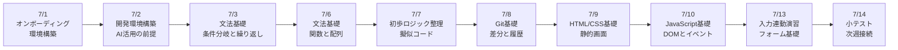
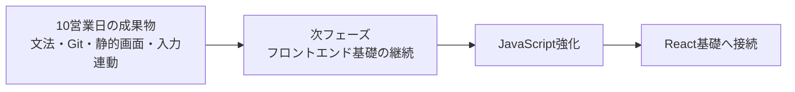

# 3か月新人育成カリキュラム 2026年7月第1-2週 詳細時間割

## 前提

- 開始日: 2026-07-01
- 対象期間: 最初の10営業日分
- 対象日: 7/1(水), 7/2(木), 7/3(金), 7/6(月), 7/7(火), 7/8(水), 7/9(木), 7/10(金), 7/13(月), 7/14(火)
- ねらい: 未経験者が開発の土台を作り、文法・ロジック・Git・静的画面実装までを段階的に身につける

## 10営業日の到達イメージ

## 週間サマリー

| 日付 | その日の主題 | その日が終わった時の状態 |
| --- | --- | --- |
| 7/1 | 研修導入と環境準備を行う | 研修ルールを理解し、必要ツールの全体像を把握できる |
| 7/2 | 開発環境構築を完了する | エディタ、ターミナル、Git、Node の基本操作を自力で再現できる |
| 7/3 | 文法基礎に入る | 変数、条件分岐、繰り返しを読んで説明できる |
| 7/6 | 文法基礎を進める | 関数、配列、オブジェクトの基本利用ができる |
| 7/7 | ロジック整理を学ぶ | 入力、処理、出力の流れを文章と擬似コードで整理できる |
| 7/8 | Git基礎を固める | 変更保存、履歴確認、差分確認を自力で行える |
| 7/9 | HTML/CSSで静的画面を作る | 指定画面を見ながら1画面を再現できる |
| 7/10 | JavaScriptで画面に動きをつける | DOM取得とイベント処理の基本を説明できる |
| 7/13 | フォームの入力連動を実装する | 入力値取得と簡単な表示連動を実装できる |
| 7/14 | 10営業日の理解確認を行う | 基礎文法、Git、静的画面、入力連動の理解不足を整理できる |

## 7/1(水)

| 時間 | セッション | 実施内容 | 期待アウトプット |
| --- | --- | --- | --- |
| 09:00-10:00 | 新人オンボーディング | 研修全体像、日報ルール、質問の出し方、事実と推測の分け方、AI利用時の検証責任を共有する | 研修ルール確認メモ |
| 10:00-12:00 | 開発の全体像理解 | システム開発の流れ、フロントエンド・バックエンド・DB の役割、3か月で目指す到達点を図で説明する | 開発全体像メモ |
| 12:00-13:00 | 環境構築準備 1 | PC設定確認、必要アカウント確認、インストール対象一覧の読み合わせを行う | 環境構築チェック表 |
| 13:00-14:00 | 環境構築準備 2 | Cursor、ターミナル、Node.js、Git の役割を未経験者向けに整理する | ツール役割メモ |
| 14:00-14:15 | 休憩 | 集中を切らさないための短休憩 | なし |
| 14:15-15:00 | AI活用の前提 | AIでできること、できないこと、生成コードをそのまま採用しない理由を確認する | AI活用ルールメモ |
| 15:00-16:30 | 初回セットアップ着手 | Cursorインストール、ターミナル起動、Git確認、Node確認までを講師伴走で進める | 初回セットアップ記録 |
| 16:30-18:00 | ふり返り | 詰まった箇所、わからなかった用語、翌日に持ち越す設定項目を整理する | 日報、未解決点リスト |

## 7/2(木)

| 時間 | セッション | 実施内容 | 期待アウトプット |
| --- | --- | --- | --- |
| 09:00-09:30 | 朝会 | 前日の詰まり共有、設定残件確認、当日ゴール整理 | 当日タスク整理 |
| 09:30-10:30 | 環境構築 1 | Git初期設定、Node.js確認、パッケージ管理の基本、フォルダ移動とコマンド実行を確認する | 環境構築メモ |
| 10:30-12:00 | 環境構築 2 | サンプルプロジェクトの取得、依存インストール、ローカル起動、停止、再起動を行う | ローカル起動成功 |
| 12:00-13:00 | 環境構築 3 | エラーが出た場合の見方、ログの読み方、詰まった時の相談文の作り方を確認する | エラー確認メモ |
| 13:00-14:00 | Git基礎導入 | `status`、`add`、`commit` の意味を、変更保存の流れとして説明する | Git基礎メモ |
| 14:00-14:15 | 休憩 | 短休憩 | なし |
| 14:15-15:00 | AI活用練習 | セットアップエラーをAIに相談する時の聞き方と、鵜呑みにしない確認方法を練習する | AI活用メモ |
| 15:00-16:30 | 再現演習 | 手順書を見ながら別フォルダで再度起動までを実施し、講師が詰まりを確認する | 再現演習記録 |
| 16:30-18:00 | 小まとめ | 今日のコマンドや設定の意味を口頭で説明し、日報に整理する | 説明メモ、日報 |

## 7/3(金)

| 時間 | セッション | 実施内容 | 期待アウトプット |
| --- | --- | --- | --- |
| 09:00-09:30 | 朝会 | 文法学習へ入る前提整理、昨日までの用語確認 | 当日タスク整理 |
| 09:30-10:30 | 文法基礎 1 | 変数、代入、文字列、数値、真偽値の基本を例題で確認する | 基礎確認メモ |
| 10:30-12:00 | 文法基礎 2 | `if`、比較演算子、条件分岐を使った簡単な判定問題を解く | 条件分岐演習 |
| 12:00-13:00 | 文法基礎 3 | `for`、繰り返し、配列の基本イメージを図で確認する | 繰り返し理解メモ |
| 13:00-14:00 | ハンズオン演習 | 合否判定、料金計算、メッセージ出し分けなどの小課題を実装する | 小課題提出 |
| 14:00-14:15 | 休憩 | 短休憩 | なし |
| 14:15-15:00 | 説明練習 | `if` と `for` が何をしているかを自分の言葉で説明する | 口頭説明メモ |
| 15:00-16:30 | 文法ミニテスト | 文法小テストと簡単な関数問題の前半として、条件分岐と繰り返しの理解を確認する | ミニテスト結果 |
| 16:30-18:00 | 週末ふり返り | わかったこと、曖昧なこと、次週補強したい文法を整理する | 週報、補強ポイント |

## 7/6(月)

| 時間 | セッション | 実施内容 | 期待アウトプット |
| --- | --- | --- | --- |
| 09:00-09:30 | 週初共有 | 先週の文法テスト返却、今週のゴール共有 | 週初メモ |
| 09:30-10:30 | 文法基礎 4 | 関数の役割、引数、戻り値を生活例とコード例で説明する | 関数基礎メモ |
| 10:30-12:00 | 文法基礎 5 | 配列、オブジェクト、要素参照の基本を手を動かして確認する | 配列・オブジェクト演習 |
| 12:00-13:00 | 文法基礎 6 | 関数と配列を組み合わせた簡単な処理を段階的に書く | 組み合わせ演習 |
| 13:00-14:00 | ハンズオン演習 | 商品一覧から合計を出す、条件に合うメッセージを返す等の小課題に取り組む | 小課題提出 |
| 14:00-14:15 | 休憩 | 短休憩 | なし |
| 14:15-15:00 | デバッグ基礎 | `undefined` や構文エラーを読み、どこを見るべきかを整理する | デバッグメモ |
| 15:00-16:30 | 文法ミニテスト | 関数、配列、オブジェクトの基本理解を確認し、説明責任も持たせる | ミニテスト結果 |
| 16:30-18:00 | 質問整理 | 曖昧な文法、説明しづらい論点、調べ方を整理する | 質問メモ、日報 |

## 7/7(火)

| 時間 | セッション | 実施内容 | 期待アウトプット |
| --- | --- | --- | --- |
| 09:00-09:30 | 朝会 | ロジック整理へ入る目的確認、文法とのつながり整理 | 当日タスク整理 |
| 09:30-10:30 | 初歩ロジック整理 1 | 入力、処理、出力の分解を、身近な題材で文章化する | 入出力整理メモ |
| 10:30-12:00 | 初歩ロジック整理 2 | 条件整理、繰り返し箇所の特定、処理順の並べ替えを演習する | 処理順整理演習 |
| 12:00-13:00 | 擬似コード導入 | 日本語ベースの擬似コードで手順を書く練習を行う | 擬似コード初版 |
| 13:00-14:00 | ロジック演習 | 「勤怠集計」「合否判定」などを文章と擬似コードで表現する | ロジック課題 |
| 14:00-14:15 | 休憩 | 短休憩 | なし |
| 14:15-15:00 | AI活用練習 | 問題文をAIに要約させ、処理分解の補助として使うが、自分で採否判断する練習をする | AI活用メモ |
| 15:00-16:30 | 講師レビュー | 擬似コードの粒度、条件漏れ、順番の妥当性をレビューする | 指摘一覧 |
| 16:30-18:00 | 反映と締め | 指摘を直し、どのロジックがコードにしやすいかを整理する | 修正版、日報 |

## 7/8(水)

| 時間 | セッション | 実施内容 | 期待アウトプット |
| --- | --- | --- | --- |
| 09:00-09:30 | 朝会 | Git基礎へ入る目的確認、昨日のロジック整理の振り返り | 当日タスク整理 |
| 09:30-10:30 | Git基礎 1 | `status`、`add`、`commit`、履歴確認の流れを講義と実演で確認する | Git基礎メモ |
| 10:30-12:00 | Git基礎 2 | 指定ファイルを変更し、コミットして履歴から変更を説明する演習を行う | Git演習結果 |
| 12:00-13:00 | Git基礎 3 | 差分確認、戻したい時の考え方、慌てず確認する手順を整理する | 差分確認メモ |
| 13:00-14:00 | Git実践の入口 | 軽いレビューコメント対応の流れ、コミットメッセージの書き方を学ぶ | レビュー対応メモ |
| 14:00-14:15 | 休憩 | 短休憩 | なし |
| 14:15-15:00 | AI活用練習 | Gitエラーや競合用語をAIに質問し、一次回答を自分で検証する練習を行う | AI活用メモ |
| 15:00-16:30 | Gitミニテスト | 指定変更をコミットし、差分と履歴を講師へ説明する | ミニテスト結果 |
| 16:30-18:00 | ふり返り | 変更保存の意味、怖かった点、理解不足を言語化する | 説明メモ、日報 |

## 7/9(木)

| 時間 | セッション | 実施内容 | 期待アウトプット |
| --- | --- | --- | --- |
| 09:00-09:30 | 朝会 | フロントエンド基礎へ入る前提整理、HTML/CSSの役割確認 | 当日タスク整理 |
| 09:30-10:30 | HTML基礎 | タグ、見出し、段落、リスト、フォーム部品の基本を確認する | HTML基礎メモ |
| 10:30-12:00 | CSS基礎 | class、色、余白、枠線、幅、高さ、Flexbox の基本を学ぶ | CSS基礎メモ |
| 12:00-13:00 | 画面分解 | 見本画面を見て、見出し、入力欄、ボタン、説明文などへ分解する | 画面分解メモ |
| 13:00-14:00 | 静的画面実装 1 | 指定画面の骨組みをHTML/CSSで作り始める | 静的画面初版 |
| 14:00-14:15 | 休憩 | 短休憩 | なし |
| 14:15-15:00 | AI活用練習 | HTML/CSSの崩れ原因をAIに相談する時の聞き方を練習する | AI活用メモ |
| 15:00-16:30 | 静的画面実装 2 | フォーム、説明文、ボタン配置までを作り、見本との差分を確認する | UI再現版 |
| 16:30-18:00 | 小まとめ | どのHTMLとCSSがどこに効いているかを説明練習する | 説明メモ、日報 |

## 7/10(金)

| 時間 | セッション | 実施内容 | 期待アウトプット |
| --- | --- | --- | --- |
| 09:00-09:30 | 朝会 | JavaScriptで画面に動きをつける目的確認 | 当日タスク整理 |
| 09:30-10:30 | JavaScript基礎 1 | DOMとは何か、HTML要素取得、クリックイベントの基本を説明する | DOM基礎メモ |
| 10:30-12:00 | JavaScript基礎 2 | ボタン押下で文言を変える、入力値を表示する等の小演習を行う | DOM演習結果 |
| 12:00-13:00 | JavaScript基礎 3 | 入力値取得、表示更新、簡単な条件分岐の組み合わせを整理する | 入力連動メモ |
| 13:00-14:00 | 画面連動実装 1 | 静的画面に対し、入力欄の値を取得して画面へ反映する | 入力連動初版 |
| 14:00-14:15 | 休憩 | 短休憩 | なし |
| 14:15-15:00 | デバッグ演習 | セレクタ誤りや `undefined` を意図的に起こし、直し方を確認する | デバッグメモ |
| 15:00-16:30 | 週次ミニテスト | 指定画面でボタン押下時の表示変更や入力取得を実装する | ミニテスト結果 |
| 16:30-18:00 | 週末ふり返り | HTML/CSS/JavaScript のつながりと未定着論点を整理する | 週報、補強ポイント |

## 7/13(月)

| 時間 | セッション | 実施内容 | 期待アウトプット |
| --- | --- | --- | --- |
| 09:00-09:30 | 週初共有 | 先週のミニテスト返却、今週の到達目標共有 | 週初メモ |
| 09:30-10:30 | フォーム基礎 1 | label、input、textarea、button の役割と使い分けを確認する | フォーム基礎メモ |
| 10:30-12:00 | フォーム基礎 2 | 必須入力、入力値表示、送信前チェックの流れを段階的に実装する | フォーム演習結果 |
| 12:00-13:00 | 入力連動演習 | 氏名や問い合わせ内容を取得し、確認欄へ表示する演習を行う | 入力連動版 |
| 13:00-14:00 | 画面改善 | ラベルや説明文、エラーメッセージの見やすさを整える | 画面改善版 |
| 14:00-14:15 | 休憩 | 短休憩 | なし |
| 14:15-15:00 | AIレビュー練習 | HTML/CSS/JavaScript の初歩コードをAIにレビューさせ、採否判断を練習する | レビュー取捨選択メモ |
| 15:00-16:30 | 改善実装 | 指摘のうち妥当なものを反映し、動作確認まで完了させる | 改善反映版 |
| 16:30-18:00 | 共有準備 | 翌日の理解確認に向け、できること・できないことを整理する | 発表メモ、日報 |

## 7/14(火)

| 時間 | セッション | 実施内容 | 期待アウトプット |
| --- | --- | --- | --- |
| 09:00-09:30 | 朝会 | 10営業日目のゴール確認、理解確認観点共有 | 当日タスク整理 |
| 09:30-10:30 | 総復習 | 環境構築、文法、ロジック、Git、HTML/CSS、DOM操作を振り返る | 総復習メモ |
| 10:30-12:00 | 小テスト 1 | 文法とロジック整理の記述テスト、短いコード読解を実施する | 小テスト結果 |
| 12:00-13:00 | 小テスト 2 | Git操作と静的画面の簡易実技確認を行う | 実技確認結果 |
| 13:00-14:00 | 口頭説明 | 自分が書いたコード、Git操作、画面構造を口頭で説明する | 口頭説明メモ |
| 14:00-14:15 | 休憩 | 短休憩 | なし |
| 14:15-15:00 | 再学習ポイント整理 | 個人ごとに弱い論点を整理し、補強優先順位を決める | 個人補強メモ |
| 15:00-16:30 | 補強演習 | 苦手な文法、Git、DOM操作を再実装または再説明する | 補強結果 |
| 16:30-18:00 | 締め | 10営業日の総括と、次のフロントエンド実践へ入る前提条件を共有する | 総括メモ、日報 |

## 講師チェックポイント

| 観点 | 7/1-7/14で見たい状態 |
| --- | --- |
| AI活用 | 生成結果を鵜呑みにせず、採用理由を言える |
| 環境構築 | 自分で起動、停止、再起動ができる |
| プログラミング基礎 | `if`、`for`、関数、配列、オブジェクトの基本を説明できる |
| ロジック整理 | 入力、処理、出力を文章と擬似コードで整理できる |
| Git基礎 | 変更保存、履歴確認、差分確認の意味を説明できる |
| 画面実装 | 静的画面と簡単な入力連動を説明しながら実装できる |
| 報連相 | 詰まりを早めに言語化して相談できる |

## 次週への接続

