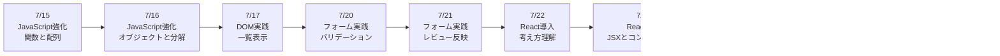
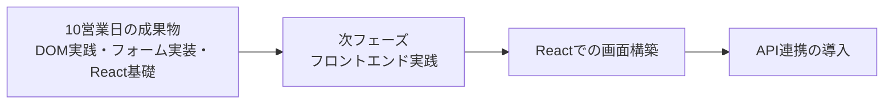

# 3か月新人育成カリキュラム 2026年7月第3-4週 詳細時間割

## 前提

- 開始日: 2026-07-15
- 対象期間: 次の10営業日分
- 対象日: 7/15(水), 7/16(木), 7/17(金), 7/20(月), 7/21(火), 7/22(水), 7/23(木), 7/24(金), 7/27(月), 7/28(火)
- ねらい: 未経験者が JavaScript の扱いを一段深め、フォーム実装から React 導入前後までを段階的に身につける

## 10営業日の到達イメージ

## 週間サマリー

| 日付 | その日の主題 | その日が終わった時の状態 |
| --- | --- | --- |
| 7/15 | JavaScript の基本処理を強化する | 関数、配列操作、繰り返しを組み合わせて処理を書ける |
| 7/16 | データの扱い方を強化する | オブジェクト、配列、条件分岐を組み合わせて説明できる |
| 7/17 | DOM を使った一覧表示を行う | 画面要素を追加・更新する流れを説明できる |
| 7/20 | フォーム実装を進める | 入力値チェックとエラーメッセージ表示を実装できる |
| 7/21 | フロントエンド基礎をまとめる | 静的画面、DOM、フォーム処理を通しで再現できる |
| 7/22 | React の考え方に入る | 直接 DOM 操作との違いを説明できる |
| 7/23 | React の基本構造を学ぶ | JSX とコンポーネントの基本を書ける |
| 7/24 | React の状態管理を学ぶ | props と state の違いを説明し、簡単に使える |
| 7/27 | 既存画面を React へ移す | 小さな画面を React で再構成できる |
| 7/28 | 次フェーズ前の理解確認を行う | React 基礎に進むための理解不足を整理できる |

## 7/15(水)

| 時間 | セッション | 実施内容 | 期待アウトプット |
| --- | --- | --- | --- |
| 09:00-10:00 | 週初共有 | 前回の補強ポイント確認、今週のゴール共有、JavaScript 強化の目的を整理する | 週初メモ |
| 10:00-12:00 | JavaScript強化 1 | 関数の再確認、引数と戻り値、同じ処理をまとめる意味を小課題で確認する | 関数復習メモ |
| 12:00-13:00 | 配列処理基礎 | 配列の取り出し、繰り返し、合計・件数算出の考え方を整理する | 配列基礎メモ |
| 13:00-14:00 | ハンズオン演習 | 商品一覧や勤怠一覧を配列で持ち、条件に応じた結果を表示する小課題に取り組む | 小課題提出 |
| 14:00-14:15 | 休憩 | 短休憩 | なし |
| 14:15-15:00 | AI活用練習 | 処理が長い時の分割案をAIに聞き、採用理由を自分で整理する | AI活用メモ |
| 15:00-16:30 | 講師レビュー | 関数の切り方、変数名、繰り返し処理の書き方をレビューする | 指摘一覧 |
| 16:30-18:00 | ふり返り | わかったこと、同じミスをしやすい箇所、翌日の不安を整理する | 日報、未解決点リスト |

## 7/16(木)

| 時間 | セッション | 実施内容 | 期待アウトプット |
| --- | --- | --- | --- |
| 09:00-09:30 | 朝会 | 前日の詰まり共有、オブジェクト理解の目的確認 | 当日タスク整理 |
| 09:30-10:30 | JavaScript強化 2 | オブジェクトの基本、キーと値、ネストしたデータの見方を確認する | オブジェクト基礎メモ |
| 10:30-12:00 | JavaScript強化 3 | 配列の中にオブジェクトがある形を扱い、条件に合うデータを探す演習を行う | データ操作演習 |
| 12:00-13:00 | ロジック再接続 | 入力、処理、出力の流れを JavaScript のコードへ落とし込む整理を行う | ロジック接続メモ |
| 13:00-14:00 | ハンズオン演習 | 問い合わせ一覧データから件数表示、条件別表示、文言出し分けを実装する | 小課題提出 |
| 14:00-14:15 | 休憩 | 短休憩 | なし |
| 14:15-15:00 | デバッグ練習 | 配列参照ミスやキー名ミスを意図的に起こし、原因の見つけ方を確認する | デバッグメモ |
| 15:00-16:30 | ミニテスト | 関数、配列、オブジェクトを使った簡単な処理を書き、口頭説明も行う | ミニテスト結果 |
| 16:30-18:00 | 小まとめ | 苦手な構文、調べ方、再学習が必要な点を整理する | 説明メモ、日報 |

## 7/17(金)

| 時間 | セッション | 実施内容 | 期待アウトプット |
| --- | --- | --- | --- |
| 09:00-09:30 | 朝会 | DOM実践へ入る前提整理、前日テスト返却 | 当日タスク整理 |
| 09:30-10:30 | DOM実践 1 | `querySelector`、`createElement`、`appendChild` の役割を確認する | DOM実践メモ |
| 10:30-12:00 | DOM実践 2 | 配列データをもとに一覧領域へ複数件を表示する演習を行う | 一覧表示初版 |
| 12:00-13:00 | DOM実践 3 | 再描画時の消し方、重複表示を防ぐ考え方、更新手順を整理する | 更新手順メモ |
| 13:00-14:00 | ハンズオン演習 | 問い合わせ一覧カードやタスク一覧を画面へ描画する | 一覧表示版 |
| 14:00-14:15 | 休憩 | 短休憩 | なし |
| 14:15-15:00 | AI活用練習 | DOM操作の冗長なコードをAIに整理させ、良し悪しを比較する | AI活用メモ |
| 15:00-16:30 | 週次レビュー | DOM操作、処理順、変数名、見通しの悪い箇所をレビューする | 指摘一覧 |
| 16:30-18:00 | 週末ふり返り | JavaScript と DOM がどうつながるかを自分の言葉で整理する | 週報、補強ポイント |

## 7/20(月)

| 時間 | セッション | 実施内容 | 期待アウトプット |
| --- | --- | --- | --- |
| 09:00-10:00 | 週初共有 | 先週のレビュー返却、今週のフォーム実践ゴール共有 | 週初メモ |
| 10:00-12:00 | フォーム実践 1 | 入力値取得、空欄チェック、文字数確認などの基本バリデーションを整理する | バリデーション基礎メモ |
| 12:00-13:00 | エラーメッセージ設計 | どのタイミングで何を表示するか、利用者目線で文言を考える | 文言整理メモ |
| 13:00-14:00 | ハンズオン演習 | 氏名、問い合わせ種別、本文の入力チェックを実装する | バリデーション初版 |
| 14:00-14:15 | 休憩 | 短休憩 | なし |
| 14:15-15:00 | デバッグ練習 | バリデーションが効かないケースを再現し、確認順を整理する | デバッグメモ |
| 15:00-16:30 | 講師レビュー | 条件漏れ、分岐の書き方、エラーメッセージの伝わりやすさを確認する | 指摘一覧 |
| 16:30-18:00 | ふり返り | 条件分岐の組み方、利用者に見せる文言の難しさを整理する | 日報、未解決点リスト |

## 7/21(火)

| 時間 | セッション | 実施内容 | 期待アウトプット |
| --- | --- | --- | --- |
| 09:00-09:30 | 朝会 | フォーム基礎の残件確認、レビュー観点共有 | 当日タスク整理 |
| 09:30-10:30 | フォーム実践 2 | 送信前チェック、入力値の確認表示、リセット動作の考え方を整理する | フォーム実践メモ |
| 10:30-12:00 | フォーム実践 3 | 入力値を確認欄へ反映し、修正時に表示も更新される処理を実装する | 入力確認版 |
| 12:00-13:00 | UI改善 | ラベル、注意文、エラー表示位置、余白を見直す | UI改善メモ |
| 13:00-14:00 | 小まとめ演習 | 静的画面、DOM操作、フォーム処理を組み合わせた小さな画面を完成させる | 小演習完成版 |
| 14:00-14:15 | 休憩 | 短休憩 | なし |
| 14:15-15:00 | AIレビュー練習 | フォーム処理コードをAIにレビューさせ、採用しない指摘の理由も書く | レビュー取捨選択メモ |
| 15:00-16:30 | フロント基礎確認 | フロントエンド基礎の口頭説明と軽い実装確認を行う | 確認結果 |
| 16:30-18:00 | 次フェーズ導入 | React に入る理由と、今の DOM 操作との違いの予告を行う | 次フェーズ接続メモ |

## 7/22(水)

| 時間 | セッション | 実施内容 | 期待アウトプット |
| --- | --- | --- | --- |
| 09:00-09:30 | 朝会 | React 導入の目的確認、これまでの画面実装との違いを共有 | 当日タスク整理 |
| 09:30-10:30 | React導入 1 | ライブラリとしての React、なぜ使うのか、コンポーネントの考え方を説明する | React導入メモ |
| 10:30-12:00 | React導入 2 | 開発環境起動、ファイル構成確認、`App` の見方をハンズオンで確認する | React起動記録 |
| 12:00-13:00 | JSX基礎 | HTML に似た書き方、波括弧での値埋め込み、className の考え方を整理する | JSX基礎メモ |
| 13:00-14:00 | ハンズオン演習 | タイトル、説明文、ボタンなどの簡単な画面を JSX で書く | JSX初版 |
| 14:00-14:15 | 休憩 | 短休憩 | なし |
| 14:15-15:00 | AI活用練習 | JSX と HTML の違いをAIに説明させ、自分でも言い換える | AI活用メモ |
| 15:00-16:30 | 講師レビュー | JSX の書き方、読み方、ファイルの見方をレビューする | 指摘一覧 |
| 16:30-18:00 | ふり返り | DOM を直接触る時との違いを整理する | 日報、未解決点リスト |

## 7/23(木)

| 時間 | セッション | 実施内容 | 期待アウトプット |
| --- | --- | --- | --- |
| 09:00-09:30 | 朝会 | コンポーネント分割の目的確認 | 当日タスク整理 |
| 09:30-10:30 | React基礎 1 | コンポーネントとは何か、役割ごとに分ける考え方を説明する | コンポーネント基礎メモ |
| 10:30-12:00 | React基礎 2 | `Header`、`Form`、`Preview` などの小さな部品へ分割する演習を行う | 分割演習結果 |
| 12:00-13:00 | props基礎 | 親から子へ値を渡す理由、受け取り方、使いどころを整理する | props基礎メモ |
| 13:00-14:00 | ハンズオン演習 | タイトルや説明文を props で切り替えられる画面を作る | props演習版 |
| 14:00-14:15 | 休憩 | 短休憩 | なし |
| 14:15-15:00 | 説明練習 | コンポーネントに分ける意味と props の役割を口頭で説明する | 口頭説明メモ |
| 15:00-16:30 | ミニテスト | 簡単な画面を複数コンポーネントへ分け、値を渡す実技確認を行う | ミニテスト結果 |
| 16:30-18:00 | 小まとめ | どこを分けるべきか迷った点を整理する | 日報、補強ポイント |

## 7/24(金)

| 時間 | セッション | 実施内容 | 期待アウトプット |
| --- | --- | --- | --- |
| 09:00-09:30 | 朝会 | state 学習の目的確認、props との違い整理 | 当日タスク整理 |
| 09:30-10:30 | React基礎 3 | `useState` の基本、画面の値が変わる仕組み、再描画の考え方を説明する | state基礎メモ |
| 10:30-12:00 | React基礎 4 | 入力値を state で持ち、表示を連動させる小演習を行う | state演習結果 |
| 12:00-13:00 | props と state の比較 | どちらが「受け取る値」でどちらが「変わる値」かを整理する | 比較メモ |
| 13:00-14:00 | ハンズオン演習 | 入力欄と確認表示を React で連動させる | 入力連動版 |
| 14:00-14:15 | 休憩 | 短休憩 | なし |
| 14:15-15:00 | デバッグ練習 | state が更新されないケース、イベントが効かないケースを確認する | デバッグメモ |
| 15:00-16:30 | 週次レビュー | JSX、props、state の理解と実装を講師が確認する | 指摘一覧 |
| 16:30-18:00 | 週末ふり返り | React に入って難しかった点、復習が必要な点を整理する | 週報、補強ポイント |

## 7/27(月)

| 時間 | セッション | 実施内容 | 期待アウトプット |
| --- | --- | --- | --- |
| 09:00-10:00 | 週初共有 | 先週レビュー返却、React 演習のゴール共有 | 週初メモ |
| 10:00-12:00 | React演習 1 | 既存の静的画面を React コンポーネントへ移植する順番を整理する | 移植方針メモ |
| 12:00-13:00 | React演習 2 | 見出し、説明文、フォーム枠をコンポーネント化する | コンポーネント初版 |
| 13:00-14:00 | React演習 3 | 入力値を state で持ち、確認欄へ表示する | React入力連動版 |
| 14:00-14:15 | 休憩 | 短休憩 | なし |
| 14:15-15:00 | AIレビュー練習 | React コードの改善案をAIに出させ、採用理由と不採用理由を整理する | AIレビュー記録 |
| 15:00-16:30 | 改善実装 | 命名、責務分離、読みやすさを改善しながら画面を整える | 改善反映版 |
| 16:30-18:00 | 共有準備 | 翌日の理解確認へ向け、説明ポイントを整理する | 発表メモ、日報 |

## 7/28(火)

| 時間 | セッション | 実施内容 | 期待アウトプット |
| --- | --- | --- | --- |
| 09:00-09:30 | 朝会 | 10営業日目のゴール確認、理解確認観点共有 | 当日タスク整理 |
| 09:30-10:30 | 総復習 | JavaScript 強化、DOM、フォーム、React 基礎を振り返る | 総復習メモ |
| 10:30-12:00 | 小テスト 1 | React の基本読解、props/state の説明、簡単な修正課題を行う | 小テスト結果 |
| 12:00-13:00 | 小テスト 2 | フロントエンド基礎から React までの実技確認を行う | 実技確認結果 |
| 13:00-14:00 | 口頭説明 | これまでの DOM 実装と React 実装の違いを口頭で説明する | 口頭説明メモ |
| 14:00-14:15 | 休憩 | 短休憩 | なし |
| 14:15-15:00 | 再学習ポイント整理 | 個人ごとに React 基礎で弱い論点を整理し、次週の補強優先順位を決める | 個人補強メモ |
| 15:00-16:30 | 補強演習 | props、state、イベント処理、コンポーネント分割の苦手箇所を再実装する | 補強結果 |
| 16:30-18:00 | 締め | 次の React 実践と API 連携へ入る前提条件を共有する | 総括メモ、日報 |

## 講師チェックポイント

| 観点 | 7/15-7/28で見たい状態 |
| --- | --- |
| JavaScript基礎 | 関数、配列、オブジェクトを組み合わせた処理を説明しながら書ける |
| DOM実践 | 一覧追加や表示更新の流れを説明できる |
| フォーム基礎 | 入力値取得、バリデーション、エラー表示を実装できる |
| React導入 | JSX と HTML の違いを説明できる |
| React基礎 | props と state の違いを説明し、簡単な画面で使える |
| AI活用 | レビューや調査でAIを使っても、採用理由を自分で言える |
| 報連相 | 詰まり、理解不足、レビュー指摘を早めに共有できる |

## 次週への接続

