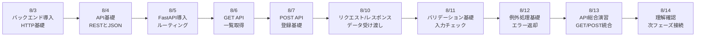
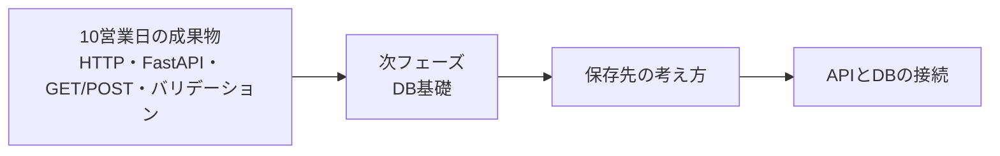

# 3か月新人育成カリキュラム 2026年8月第1-2週 詳細時間割

## 前提

- 開始日: 2026-08-03
- 対象期間: 8月最初の10営業日分
- 対象日: 8/3(月), 8/4(火), 8/5(水), 8/6(木), 8/7(金), 8/10(月), 8/11(火), 8/12(水), 8/13(木), 8/14(金)
- ねらい: フロントエンド基礎の次段階として、HTTP、API、FastAPI、リクエスト/レスポンス、バリデーションの基礎を未経験者向けに段階的に身につける

## 10営業日の到達イメージ

## 週間サマリー

| 日付 | その日の主題 | その日が終わった時の状態 |
| --- | --- | --- |
| 8/3 | バックエンドの役割を理解する | フロントエンドとAPIの役割分担を説明できる |
| 8/4 | HTTPとAPIの基本を学ぶ | GET/POST、JSON、RESTの基本を説明できる |
| 8/5 | FastAPIに入る | ルーティングと最小APIの作り方を再現できる |
| 8/6 | GET APIを作る | 一覧取得APIを作り、動作確認できる |
| 8/7 | POST APIを作る | データ登録APIの基本を実装できる |
| 8/10 | データ受け渡しを理解する | リクエストとレスポンスの流れを説明できる |
| 8/11 | バリデーションを学ぶ | 入力値チェックの必要性と基本実装を説明できる |
| 8/12 | 例外処理を学ぶ | エラー時の返し方と確認方法を説明できる |
| 8/13 | APIを通しで作る | GET/POST を組み合わせた小さなAPIを作れる |
| 8/14 | 次フェーズ前の理解確認を行う | バックエンド基礎で不足している理解を整理できる |

## 8/3(月)

| 時間 | セッション | 実施内容 | 期待アウトプット |
| --- | --- | --- | --- |
| 09:00-10:00 | 週初共有 | 前回までのフロントエンド学習を振り返り、今週からバックエンドへ入る目的を共有する | 週初メモ |
| 10:00-12:00 | バックエンド導入 1 | バックエンドとは何か、ブラウザからサーバまでの流れ、なぜAPIが必要かを図で説明する | バックエンド導入メモ |
| 12:00-13:00 | 全体像整理 | 画面、API、DB のつながりを再確認し、これからどこを学ぶかを言語化する | 全体像整理メモ |
| 13:00-14:00 | HTTP導入 | リクエスト、レスポンス、URL、メソッド、ステータスコードの用語を整理する | HTTP基礎メモ |
| 14:00-14:15 | 休憩 | 短休憩 | なし |
| 14:15-15:00 | AI活用練習 | HTTPやAPIの説明をAIに要約させ、自分の言葉に言い換える練習をする | AI活用メモ |
| 15:00-16:30 | 講師確認 | 用語の理解、画面からAPIへつながる流れの説明を口頭で確認する | 確認結果 |
| 16:30-18:00 | ふり返り | 難しかった用語、前提知識の不足、次日に持ち越す疑問を整理する | 日報、未解決点リスト |

## 8/4(火)

| 時間 | セッション | 実施内容 | 期待アウトプット |
| --- | --- | --- | --- |
| 09:00-09:30 | 朝会 | 前日の詰まり共有、HTTP理解の残件確認 | 当日タスク整理 |
| 09:30-10:30 | API基礎 1 | GET/POST の違い、RESTの基本、JSONの形を具体例で確認する | API基礎メモ |
| 10:30-12:00 | API基礎 2 | リクエスト例とレスポンス例を読み、何が返っているかを整理する | リクエスト/レスポンス読解メモ |
| 12:00-13:00 | ハンズオン準備 | APIクライアント相当の確認方法、ブラウザ/ツールでの呼び出しイメージを整理する | 呼び出し確認メモ |
| 13:00-14:00 | 小演習 | サンプルAPIの仕様を読み、どのデータが返るかを文章で説明する | 小演習結果 |
| 14:00-14:15 | 休憩 | 短休憩 | なし |
| 14:15-15:00 | デバッグ練習 | URL違い、メソッド違い、JSON形式違いなどを見分ける練習をする | デバッグメモ |
| 15:00-16:30 | ミニテスト | GET/POST/JSON/REST の基本を記述と口頭で確認する | ミニテスト結果 |
| 16:30-18:00 | 小まとめ | 理解が浅い用語と次日の FastAPI 学習に必要な前提を整理する | 説明メモ、日報 |

## 8/5(水)

| 時間 | セッション | 実施内容 | 期待アウトプット |
| --- | --- | --- | --- |
| 09:00-09:30 | 朝会 | FastAPI導入の目的確認、昨日のテスト返却 | 当日タスク整理 |
| 09:30-10:30 | FastAPI導入 1 | FastAPI の役割、最小構成、`app` とルーティングの基本を説明する | FastAPI導入メモ |
| 10:30-12:00 | FastAPI導入 2 | 最小の `Hello API` を作成し、起動からアクセス確認までを行う | 起動確認結果 |
| 12:00-13:00 | ファイル構成理解 | `main.py` 相当の見方、関数とデコレータの役割を整理する | ファイル構成メモ |
| 13:00-14:00 | ハンズオン演習 | ルートAPI、自己紹介APIなどの単純なエンドポイントを作る | ルーティング初版 |
| 14:00-14:15 | 休憩 | 短休憩 | なし |
| 14:15-15:00 | AI活用練習 | FastAPIのひな形をAIに出させ、どこが何をしているか自分で注釈する | AI活用メモ |
| 15:00-16:30 | 講師レビュー | 起動方法、ルーティングの意味、コードの読み方を確認する | 指摘一覧 |
| 16:30-18:00 | ふり返り | フロントとの違い、読めない記法、再学習ポイントを整理する | 日報、未解決点リスト |

## 8/6(木)

| 時間 | セッション | 実施内容 | 期待アウトプット |
| --- | --- | --- | --- |
| 09:00-09:30 | 朝会 | GET API作成の目的確認、ルーティングの復習 | 当日タスク整理 |
| 09:30-10:30 | GET API基礎 | 一覧取得API、固定データ返却、配列をJSONで返す考え方を説明する | GET基礎メモ |
| 10:30-12:00 | GET API実装 1 | 問い合わせ一覧や商品一覧を模した固定データ返却APIを作る | GET API初版 |
| 12:00-13:00 | 動作確認 | エンドポイントへアクセスし、レスポンスを確認しながら値を読む | 動作確認記録 |
| 13:00-14:00 | ハンズオン演習 | パス違いで返す内容を変える、一覧件数を変えるなどの演習を行う | 演習結果 |
| 14:00-14:15 | 休憩 | 短休憩 | なし |
| 14:15-15:00 | デバッグ練習 | パス誤り、起動忘れ、構文ミスなどの切り分けを練習する | デバッグメモ |
| 15:00-16:30 | ミニテスト | GET APIを1本作り、返り値の意味を口頭で説明する | ミニテスト結果 |
| 16:30-18:00 | 小まとめ | GET APIの流れ、理解不足、翌日のPOSTに向けた疑問を整理する | 説明メモ、日報 |

## 8/7(金)

| 時間 | セッション | 実施内容 | 期待アウトプット |
| --- | --- | --- | --- |
| 09:00-09:30 | 朝会 | POST 学習の目的確認、GET との違い整理 | 当日タスク整理 |
| 09:30-10:30 | POST API基礎 | POST で送る意味、登録処理のイメージ、受け取るデータの形を説明する | POST基礎メモ |
| 10:30-12:00 | POST API実装 1 | 固定データを受け取り、受信内容をそのまま返す簡単なAPIを作る | POST API初版 |
| 12:00-13:00 | 動作確認 | 送信データがどうAPIへ届くかを確認し、レスポンスとの違いを整理する | 動作確認記録 |
| 13:00-14:00 | ハンズオン演習 | 名前や問い合わせ内容を受け取り、成功メッセージを返す演習を行う | 登録演習版 |
| 14:00-14:15 | 休憩 | 短休憩 | なし |
| 14:15-15:00 | AIレビュー練習 | GET と POST のコード差分をAIに説明させ、自分でも説明し直す | レビュー取捨選択メモ |
| 15:00-16:30 | 週次レビュー | GET/POST の違い、受け取り方、返し方を講師が確認する | 指摘一覧 |
| 16:30-18:00 | 週末ふり返り | HTTP と FastAPI のつながり、混乱した点を整理する | 週報、補強ポイント |

## 8/10(月)

| 時間 | セッション | 実施内容 | 期待アウトプット |
| --- | --- | --- | --- |
| 09:00-10:00 | 週初共有 | 先週のレビュー返却、今週のリクエスト/レスポンス学習のゴール共有 | 週初メモ |
| 10:00-12:00 | データ受け渡し 1 | クエリパラメータ、パスパラメータ、ボディの違いを未経験者向けに整理する | データ受け渡しメモ |
| 12:00-13:00 | データ受け渡し 2 | どこに何の値を置くのかを例題で整理する | 値の置き場メモ |
| 13:00-14:00 | ハンズオン演習 | ID指定取得、キーワード検索、登録データ受信などの小演習を行う | 演習結果 |
| 14:00-14:15 | 休憩 | 短休憩 | なし |
| 14:15-15:00 | デバッグ練習 | 値が取れない時に、URL・関数引数・送信データのどこを見るかを整理する | デバッグメモ |
| 15:00-16:30 | 講師確認 | パラメータの違いと使いどころを口頭とコードで確認する | 確認結果 |
| 16:30-18:00 | ふり返り | リクエストとレスポンスの混同箇所を整理する | 日報、未解決点リスト |

## 8/11(火)

| 時間 | セッション | 実施内容 | 期待アウトプット |
| --- | --- | --- | --- |
| 09:00-09:30 | 朝会 | バリデーション導入の目的確認 | 当日タスク整理 |
| 09:30-10:30 | バリデーション基礎 1 | なぜ入力チェックが必要か、不正データで何が困るかを説明する | バリデーション基礎メモ |
| 10:30-12:00 | バリデーション基礎 2 | 必須、文字数、形式などの代表的なチェックを整理する | チェック観点メモ |
| 12:00-13:00 | FastAPIでの入力定義 | モデル定義の考え方と、入力制約をどこへ書くかを整理する | 入力定義メモ |
| 13:00-14:00 | ハンズオン演習 | 必須項目や文字数制約つきの登録APIを作る | バリデーション初版 |
| 14:00-14:15 | 休憩 | 短休憩 | なし |
| 14:15-15:00 | AI活用練習 | バリデーション条件の漏れをAIに出させ、自分で採否判断する | AI活用メモ |
| 15:00-16:30 | ミニテスト | 入力チェック付きAPIを作り、何を防いでいるか説明する | ミニテスト結果 |
| 16:30-18:00 | 小まとめ | チェック条件の考え方、抜けやすい観点を整理する | 説明メモ、日報 |

## 8/12(水)

| 時間 | セッション | 実施内容 | 期待アウトプット |
| --- | --- | --- | --- |
| 09:00-09:30 | 朝会 | 例外処理導入の目的確認、バリデーションとの違い整理 | 当日タスク整理 |
| 09:30-10:30 | 例外処理基礎 1 | 想定外エラーと想定内エラーの違い、なぜ丁寧に返す必要があるかを説明する | 例外処理基礎メモ |
| 10:30-12:00 | 例外処理基礎 2 | エラー時の返し方、メッセージの考え方、ステータスコードとの関係を整理する | エラー返却メモ |
| 12:00-13:00 | ハンズオン準備 | 存在しないID、空データ、形式不正などの失敗パターンを洗い出す | 異常系メモ |
| 13:00-14:00 | ハンズオン演習 | 簡単な異常系分岐を含むAPIを実装し、返り値を確認する | 例外処理初版 |
| 14:00-14:15 | 休憩 | 短休憩 | なし |
| 14:15-15:00 | デバッグ練習 | エラー発生時のログ、レスポンス、入力値のどれから見るかを整理する | デバッグメモ |
| 15:00-16:30 | 講師レビュー | 異常系の考え方、返却内容、説明のわかりやすさを確認する | 指摘一覧 |
| 16:30-18:00 | ふり返り | 想定内/想定外の違い、苦手な異常系を整理する | 日報、未解決点リスト |

## 8/13(木)

| 時間 | セッション | 実施内容 | 期待アウトプット |
| --- | --- | --- | --- |
| 09:00-09:30 | 朝会 | API総合演習の目的確認、今までの要素整理 | 当日タスク整理 |
| 09:30-10:30 | 総合演習準備 | 問い合わせAPIまたはタスクAPIの最小仕様を読み、必要なGET/POSTを整理する | 仕様整理メモ |
| 10:30-12:00 | API総合演習 1 | 一覧取得APIと登録APIを同じアプリ内へ実装する | 総合演習初版 |
| 12:00-13:00 | API総合演習 2 | 入力チェックと簡単な異常系返却を追加する | 総合演習改善版 |
| 13:00-14:00 | 動作確認 | 正常系、必須エラー、存在しない値などを順に確認する | 動作確認記録 |
| 14:00-14:15 | 休憩 | 短休憩 | なし |
| 14:15-15:00 | AIレビュー練習 | API全体の改善点をAIに出させ、優先順位をつけて採否判断する | AIレビュー記録 |
| 15:00-16:30 | 講師レビュー | API責務、命名、入力チェック、異常系の抜け漏れを確認する | 指摘一覧 |
| 16:30-18:00 | 共有準備 | 翌日の理解確認に向け、何を作ったか・何が難しかったかを整理する | 発表メモ、日報 |

## 8/14(金)

| 時間 | セッション | 実施内容 | 期待アウトプット |
| --- | --- | --- | --- |
| 09:00-09:30 | 朝会 | 10営業日目のゴール確認、理解確認観点共有 | 当日タスク整理 |
| 09:30-10:30 | 総復習 | HTTP、FastAPI、GET/POST、バリデーション、例外処理を振り返る | 総復習メモ |
| 10:30-12:00 | 小テスト 1 | API読解、メソッド選択、入力チェックの考え方を記述と口頭で確認する | 小テスト結果 |
| 12:00-13:00 | 小テスト 2 | GET API または POST API を1本作る実技確認を行う | 実技確認結果 |
| 13:00-14:00 | 口頭説明 | 自分のAPIが何を受け取り、何を返すかを口頭で説明する | 口頭説明メモ |
| 14:00-14:15 | 休憩 | 短休憩 | なし |
| 14:15-15:00 | 再学習ポイント整理 | 個人ごとにバックエンド基礎で弱い論点を整理し、次週の補強優先順位を決める | 個人補強メモ |
| 15:00-16:30 | 補強演習 | ルーティング、GET/POST、バリデーション、例外処理の苦手箇所を再実装する | 補強結果 |
| 16:30-18:00 | 締め | 次のDB基礎へ入る前提条件と、画面/API/DBの接続イメージを共有する | 総括メモ、日報 |

## 講師チェックポイント

| 観点 | 8/3-8/14で見たい状態 |
| --- | --- |
| HTTP基礎 | リクエスト、レスポンス、GET、POST の違いを説明できる |
| FastAPI基礎 | ルーティングと最小APIの作り方を再現できる |
| API実装 | GET/POST API を1本ずつ作り、返り値を説明できる |
| バリデーション | なぜ入力チェックが必要かを説明し、基本実装できる |
| 例外処理 | 基本的な異常系返却を実装し、確認方法を説明できる |
| AI活用 | 調査やレビューにAIを使っても、採用理由を自分で言える |
| 報連相 | 詰まり、エラー、理解不足を早めに共有できる |

## 次週への接続

