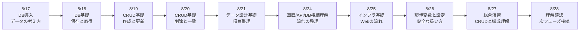
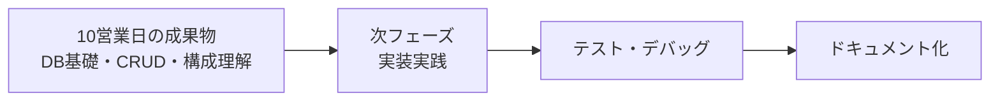

# 3か月新人育成カリキュラム 2026年8月第3-4週 詳細時間割

## 前提

- 開始日: 2026-08-17
- 対象期間: 8月後半の10営業日分
- 対象日: 8/17(月), 8/18(火), 8/19(水), 8/20(木), 8/21(金), 8/24(月), 8/25(火), 8/26(水), 8/27(木), 8/28(金)
- ねらい: バックエンド基礎の次段階として、DB基礎、CRUD、データ設計、インフラ基礎、画面/API/DBのつながりを未経験者向けに段階的に身につける

## 10営業日の到達イメージ

## 週間サマリー

| 日付 | その日の主題 | その日が終わった時の状態 |
| --- | --- | --- |
| 8/17 | DBの役割を理解する | なぜデータ保存先が必要かを説明できる |
| 8/18 | DB基礎を学ぶ | 保存、取得、データ構造の基本を説明できる |
| 8/19 | CRUDの前半を学ぶ | 作成と更新の基本操作を説明できる |
| 8/20 | CRUDの後半を学ぶ | 一覧表示と削除の基本操作を説明できる |
| 8/21 | データ設計の基礎を学ぶ | どんな項目を持つべきかを整理できる |
| 8/24 | 画面/API/DBのつながりを理解する | 入力から保存までの流れを図で説明できる |
| 8/25 | インフラ基礎を学ぶ | ブラウザからサーバまでのWebの流れを説明できる |
| 8/26 | 設定管理の基本を学ぶ | 環境変数や設定値を安全に扱う理由を説明できる |
| 8/27 | ここまでを通しで整理する | CRUDと構成理解をまとめて確認できる |
| 8/28 | 次フェーズ前の理解確認を行う | DB・インフラ基礎で不足している理解を整理できる |

## 8/17(月)

| 時間 | セッション | 実施内容 | 期待アウトプット |
| --- | --- | --- | --- |
| 09:00-10:00 | 週初共有 | 前回のバックエンド基礎を振り返り、今週からDBへ入る目的を共有する | 週初メモ |
| 10:00-12:00 | DB導入 1 | DBとは何か、なぜ保存先が必要か、メモリ上の値との違いを説明する | DB導入メモ |
| 12:00-13:00 | 全体像整理 | 画面、API、DB の役割分担と保存の流れを再確認する | 全体像整理メモ |
| 13:00-14:00 | データの見方 | レコード、項目、ID、一覧という見方を未経験者向けに整理する | データ見方メモ |
| 14:00-14:15 | 休憩 | 短休憩 | なし |
| 14:15-15:00 | AI活用練習 | DBの必要性をAIに要約させ、自分の言葉で言い換える練習をする | AI活用メモ |
| 15:00-16:30 | 講師確認 | 保存の必要性、データの持ち方、IDの意味を口頭で確認する | 確認結果 |
| 16:30-18:00 | ふり返り | 難しかった用語、前提知識の不足、翌日に持ち越す疑問を整理する | 日報、未解決点リスト |

## 8/18(火)

| 時間 | セッション | 実施内容 | 期待アウトプット |
| --- | --- | --- | --- |
| 09:00-09:30 | 朝会 | 前日の詰まり共有、保存と取得の理解確認 | 当日タスク整理 |
| 09:30-10:30 | DB基礎 1 | 保存、取得、一覧という基本操作を具体例で説明する | DB基礎メモ |
| 10:30-12:00 | DB基礎 2 | サンプルデータを見ながら、どの項目が必要か、どの形で持つかを整理する | データ構造メモ |
| 12:00-13:00 | ハンズオン準備 | 問い合わせやタスクを例に、保存したい項目一覧を洗い出す | 項目一覧メモ |
| 13:00-14:00 | 小演習 | 指定された業務データを保存しやすい形へ並べ替える演習を行う | 小演習結果 |
| 14:00-14:15 | 休憩 | 短休憩 | なし |
| 14:15-15:00 | デバッグ練習 | 項目不足、ID重複、形式揺れなどの問題を見分ける練習をする | デバッグメモ |
| 15:00-16:30 | ミニテスト | 保存したいデータを項目に分解し、理由を口頭で説明する | ミニテスト結果 |
| 16:30-18:00 | 小まとめ | DBで持つべき情報と持たなくてよい情報の違いを整理する | 説明メモ、日報 |

## 8/19(水)

| 時間 | セッション | 実施内容 | 期待アウトプット |
| --- | --- | --- | --- |
| 09:00-09:30 | 朝会 | CRUD導入の目的確認、昨日のテスト返却 | 当日タスク整理 |
| 09:30-10:30 | CRUD基礎 1 | Create と Update の違い、いつ新規作成し、いつ更新するかを説明する | CRUD基礎メモ |
| 10:30-12:00 | CRUD基礎 2 | 追加と更新のデータ例を比較し、IDの扱いを整理する | 追加更新比較メモ |
| 12:00-13:00 | API再接続 | POST APIで受け取ったデータが保存される流れを振り返る | API再接続メモ |
| 13:00-14:00 | ハンズオン演習 | 新規登録と既存データ更新の小演習を行う | Create/Update演習結果 |
| 14:00-14:15 | 休憩 | 短休憩 | なし |
| 14:15-15:00 | AI活用練習 | 追加と更新の違いをAIに説明させ、自分でも図解し直す | AI活用メモ |
| 15:00-16:30 | 講師レビュー | IDの扱い、上書きの考え方、入力データとの対応を確認する | 指摘一覧 |
| 16:30-18:00 | ふり返り | 追加と更新の混同箇所を整理する | 日報、未解決点リスト |

## 8/20(木)

| 時間 | セッション | 実施内容 | 期待アウトプット |
| --- | --- | --- | --- |
| 09:00-09:30 | 朝会 | Read/Delete 学習の目的確認 | 当日タスク整理 |
| 09:30-10:30 | CRUD基礎 3 | 一覧取得、1件取得、削除の違いを具体例で説明する | Read/Delete基礎メモ |
| 10:30-12:00 | CRUD基礎 4 | 削除時に何が消えるか、一覧にどう反映されるかを整理する | 削除整理メモ |
| 12:00-13:00 | ハンズオン準備 | 一覧と詳細、削除後の状態をどう確認するかを整理する | 確認手順メモ |
| 13:00-14:00 | ハンズオン演習 | 一覧取得、詳細取得、削除の一連を小演習で確認する | Read/Delete演習結果 |
| 14:00-14:15 | 休憩 | 短休憩 | なし |
| 14:15-15:00 | デバッグ練習 | 削除対象が見つからない時、一覧が更新されない時の切り分けを練習する | デバッグメモ |
| 15:00-16:30 | ミニテスト | CRUD全体の違いを説明し、Read/Deleteの基本実装を確認する | ミニテスト結果 |
| 16:30-18:00 | 小まとめ | CRUD 4操作を自分の言葉で整理する | 説明メモ、日報 |

## 8/21(金)

| 時間 | セッション | 実施内容 | 期待アウトプット |
| --- | --- | --- | --- |
| 09:00-09:30 | 朝会 | データ設計基礎へ入る目的確認 | 当日タスク整理 |
| 09:30-10:30 | データ設計基礎 1 | 何を1件として持つか、どの項目が必要か、ID以外に何を持つかを説明する | データ設計基礎メモ |
| 10:30-12:00 | データ設計基礎 2 | 問い合わせ、タスク、ユーザなどの例で項目設計を比較する | 項目比較メモ |
| 12:00-13:00 | 正規化の入口 | 重複を減らす考え方、同じ情報を何度も持つリスクを未経験者向けに整理する | 重複整理メモ |
| 13:00-14:00 | ハンズオン演習 | サンプル業務をもとにデータ項目表を作る | 項目表初版 |
| 14:00-14:15 | 休憩 | 短休憩 | なし |
| 14:15-15:00 | AIレビュー練習 | 項目漏れや重複候補をAIに出させ、自分で採否判断する | AIレビュー記録 |
| 15:00-16:30 | 週次レビュー | 項目設計、ID設計、重複の考え方を講師が確認する | 指摘一覧 |
| 16:30-18:00 | 週末ふり返り | データ設計で迷った点、理解不足を整理する | 週報、補強ポイント |

## 8/24(月)

| 時間 | セッション | 実施内容 | 期待アウトプット |
| --- | --- | --- | --- |
| 09:00-10:00 | 週初共有 | 先週のレビュー返却、今週の接続理解のゴール共有 | 週初メモ |
| 10:00-12:00 | 接続理解 1 | 画面入力がAPIを通りDBに保存される流れを図で整理する | 接続理解メモ |
| 12:00-13:00 | 接続理解 2 | 一覧表示時に、DBからデータを取り出して画面へ返す流れを確認する | データ流れメモ |
| 13:00-14:00 | ハンズオン演習 | 入力→保存→取得→表示の流れを擬似的に追い、処理順を書き出す | 処理順演習 |
| 14:00-14:15 | 休憩 | 短休憩 | なし |
| 14:15-15:00 | デバッグ練習 | どの層で止まっているかを、画面/API/DBの観点で切り分ける練習をする | デバッグメモ |
| 15:00-16:30 | 講師確認 | 画面/API/DBの関係を口頭と図で説明できるか確認する | 確認結果 |
| 16:30-18:00 | ふり返り | つながりの中で曖昧な層や用語を整理する | 日報、未解決点リスト |

## 8/25(火)

| 時間 | セッション | 実施内容 | 期待アウトプット |
| --- | --- | --- | --- |
| 09:00-09:30 | 朝会 | インフラ基礎導入の目的確認 | 当日タスク整理 |
| 09:30-10:30 | インフラ基礎 1 | ブラウザ、ネットワーク、サーバ、DBがどう並ぶかを説明する | インフラ基礎メモ |
| 10:30-12:00 | インフラ基礎 2 | DNS、URL、環境ごとの違い、ローカルと本番の違いを整理する | Webの流れメモ |
| 12:00-13:00 | 図解演習 | ブラウザからDBまでの流れを自分で図にする | 図解演習結果 |
| 13:00-14:00 | ハンズオン演習 | リクエストがどこを通るか、各層の役割を書き出す | レイヤ整理メモ |
| 14:00-14:15 | 休憩 | 短休憩 | なし |
| 14:15-15:00 | AI活用練習 | Webの流れをAIに説明させ、誤解しやすい箇所を自分で補足する | AI活用メモ |
| 15:00-16:30 | ミニテスト | ブラウザからDBまでの流れを図と口頭で説明する | ミニテスト結果 |
| 16:30-18:00 | 小まとめ | インフラ用語で混乱した点、再学習ポイントを整理する | 説明メモ、日報 |

## 8/26(水)

| 時間 | セッション | 実施内容 | 期待アウトプット |
| --- | --- | --- | --- |
| 09:00-09:30 | 朝会 | 設定管理学習の目的確認 | 当日タスク整理 |
| 09:30-10:30 | 設定管理 1 | 環境変数、設定ファイル、秘匿すべき値の考え方を説明する | 設定管理メモ |
| 10:30-12:00 | 設定管理 2 | ローカル値と本番値が違う理由、コードに直書きしない理由を整理する | 環境差分メモ |
| 12:00-13:00 | セキュリティ接続 | 機密情報、認証情報、扱いを間違えた時のリスクを確認する | セキュリティ接続メモ |
| 13:00-14:00 | ハンズオン演習 | 設定値と業務データを分けて考える小演習を行う | 演習結果 |
| 14:00-14:15 | 休憩 | 短休憩 | なし |
| 14:15-15:00 | デバッグ練習 | 設定値が読めない、値が違う、環境差分がある時の確認観点を整理する | デバッグメモ |
| 15:00-16:30 | 講師レビュー | 環境変数の意味、安全な扱い方、説明のわかりやすさを確認する | 指摘一覧 |
| 16:30-18:00 | ふり返り | 設定値と業務データの違い、危険な扱い方を整理する | 日報、未解決点リスト |

## 8/27(木)

| 時間 | セッション | 実施内容 | 期待アウトプット |
| --- | --- | --- | --- |
| 09:00-09:30 | 朝会 | 総合演習の目的確認、今までの要素整理 | 当日タスク整理 |
| 09:30-10:30 | 総合演習準備 | 小さな問い合わせ管理またはタスク管理の構成を読み、CRUDと構成図を整理する | 仕様整理メモ |
| 10:30-12:00 | 総合演習 1 | データ項目、GET/POST、一覧/登録の関係をまとめて確認する | 総合演習初版 |
| 12:00-13:00 | 総合演習 2 | 画面/API/DB/設定の関係を図と文章で整理する | 総合演習改善版 |
| 13:00-14:00 | 動作確認 | CRUD観点、保存観点、設定観点を順に確認する | 動作確認記録 |
| 14:00-14:15 | 休憩 | 短休憩 | なし |
| 14:15-15:00 | AIレビュー練習 | 構成や項目の抜け漏れをAIに出させ、優先順位をつけて採否判断する | AIレビュー記録 |
| 15:00-16:30 | 講師レビュー | データ設計、CRUD、構成理解、説明のつながりを確認する | 指摘一覧 |
| 16:30-18:00 | 共有準備 | 翌日の理解確認に向け、何を整理できたかをまとめる | 発表メモ、日報 |

## 8/28(金)

| 時間 | セッション | 実施内容 | 期待アウトプット |
| --- | --- | --- | --- |
| 09:00-09:30 | 朝会 | 10営業日目のゴール確認、理解確認観点共有 | 当日タスク整理 |
| 09:30-10:30 | 総復習 | DB基礎、CRUD、データ設計、インフラ基礎、設定管理を振り返る | 総復習メモ |
| 10:30-12:00 | 小テスト 1 | CRUD、ID、データ構造、構成理解を記述と口頭で確認する | 小テスト結果 |
| 12:00-13:00 | 小テスト 2 | 画面/API/DB の流れを図で説明し、簡易実技確認を行う | 実技確認結果 |
| 13:00-14:00 | 口頭説明 | 自分が整理したデータ構造と構成を口頭で説明する | 口頭説明メモ |
| 14:00-14:15 | 休憩 | 短休憩 | なし |
| 14:15-15:00 | 再学習ポイント整理 | 個人ごとにDB・インフラ基礎で弱い論点を整理し、次週の補強優先順位を決める | 個人補強メモ |
| 15:00-16:30 | 補強演習 | CRUD、項目設計、構成理解、設定管理の苦手箇所を再説明または再整理する | 補強結果 |
| 16:30-18:00 | 締め | 次の実装実践フェーズへ入る前提条件と、テスト・デバッグへつながる観点を共有する | 総括メモ、日報 |

## 講師チェックポイント

| 観点 | 8/17-8/28で見たい状態 |
| --- | --- |
| DB基礎 | 保存、取得、一覧、IDの意味を説明できる |
| CRUD理解 | Create/Read/Update/Delete の違いを説明できる |
| データ設計 | 項目設計と重複の考え方を基本レベルで説明できる |
| 接続理解 | 画面/API/DB の流れを図と口頭で説明できる |
| インフラ基礎 | ブラウザからサーバまでの流れを説明できる |
| 設定管理 | 環境変数と業務データの違い、安全な扱い方を説明できる |
| AI活用 | 調査やレビューにAIを使っても、採用理由を自分で言える |
| 報連相 | 詰まり、設計漏れ、理解不足を早めに共有できる |

## 次週への接続

