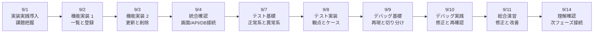
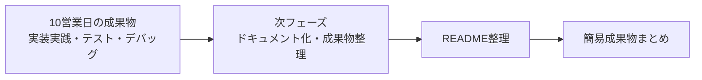

# 3か月新人育成カリキュラム 2026年9月第1-2週 詳細時間割

## 前提

- 開始日: 2026-09-01
- 対象期間: 9月前半の10営業日分
- 対象日: 9/1(火), 9/2(水), 9/3(木), 9/4(金), 9/7(月), 9/8(火), 9/9(水), 9/10(木), 9/11(金), 9/14(月)
- ねらい: ここまで学んだフロントエンド、API、DB、構成理解をつないで、小規模機能の実装、テスト、デバッグ、自走的な改善までを段階的に経験する

## 10営業日の到達イメージ

## 週間サマリー

| 日付 | その日の主題 | その日が終わった時の状態 |
| --- | --- | --- |
| 9/1 | 実装実践の全体像を理解する | 小規模機能をどの順で作るか説明できる |
| 9/2 | 登録と一覧の基本機能を実装する | 画面からAPI経由で一覧と登録を扱える |
| 9/3 | 更新と削除の基本機能を実装する | CRUDを一通りつないで説明できる |
| 9/4 | 接続全体を見直す | 画面/API/DBの流れを追いながら動作確認できる |
| 9/7 | テストの考え方を学ぶ | 正常系と異常系の違いを説明できる |
| 9/8 | テスト観点を実装へ落とす | 基本的なテストケースを整理できる |
| 9/9 | デバッグの進め方を学ぶ | 再現、原因候補、確認順を説明できる |
| 9/10 | 不具合修正を実践する | 原因を切り分けて修正し、再確認できる |
| 9/11 | 実装から修正までを通す | 小規模機能を改善付きでまとめられる |
| 9/14 | 次フェーズ前の理解確認を行う | 実装実践で不足している理解を整理できる |

## 9/1(火)

| 時間 | セッション | 実施内容 | 期待アウトプット |
| --- | --- | --- | --- |
| 09:00-10:00 | 週初共有 | これまでのフロント、API、DB学習を振り返り、今週からの実装実践の狙いを共有する | 週初メモ |
| 10:00-12:00 | 実装実践導入 1 | 小規模機能を作る時の流れを、画面、API、DB、確認の順で説明する | 実装実践導入メモ |
| 12:00-13:00 | 課題把握 | 問い合わせ管理やタスク管理などの簡易仕様を読み、必要な機能を洗い出す | 仕様整理メモ |
| 13:00-14:00 | タスク分解 | 一覧、登録、更新、削除、確認のどれから着手するかを整理する | タスク分解メモ |
| 14:00-14:15 | 休憩 | 短休憩 | なし |
| 14:15-15:00 | AI活用練習 | 仕様をAIに要約させ、抜け漏れがないか自分で確認する練習をする | AI活用メモ |
| 15:00-16:30 | 講師確認 | タスク分解、優先順位、作業順の妥当性を確認する | 確認結果 |
| 16:30-18:00 | ふり返り | 何から作るか迷った点、不足知識、翌日の実装不安を整理する | 日報、未解決点リスト |

## 9/2(水)

| 時間 | セッション | 実施内容 | 期待アウトプット |
| --- | --- | --- | --- |
| 09:00-09:30 | 朝会 | 前日の詰まり共有、一覧と登録を先に作る理由の再確認 | 当日タスク整理 |
| 09:30-10:30 | 機能実装 1 | 一覧表示の要件と登録処理の要件を見直す | 要件整理メモ |
| 10:30-12:00 | 機能実装 2 | 画面入力からPOST APIを呼び、登録後に一覧へ反映する流れを実装する | 一覧登録初版 |
| 12:00-13:00 | 動作確認 | 入力、送信、反映の順に確認し、どこで値が変わるかを追う | 動作確認記録 |
| 13:00-14:00 | UI改善 | 入力欄、一覧、エラーメッセージの見え方を整える | UI改善版 |
| 14:00-14:15 | 休憩 | 短休憩 | なし |
| 14:15-15:00 | デバッグ練習 | 登録されない時、一覧が更新されない時の確認順を整理する | デバッグメモ |
| 15:00-16:30 | 講師レビュー | 画面/API/DBのつながり、変数名、責務分離を確認する | 指摘一覧 |
| 16:30-18:00 | 小まとめ | 一覧と登録の流れを図と口頭で説明できるよう整理する | 説明メモ、日報 |

## 9/3(木)

| 時間 | セッション | 実施内容 | 期待アウトプット |
| --- | --- | --- | --- |
| 09:00-09:30 | 朝会 | 更新と削除の学習目的確認 | 当日タスク整理 |
| 09:30-10:30 | 機能実装 3 | 更新と削除の要件、既存データへの影響、確認観点を整理する | 更新削除要件メモ |
| 10:30-12:00 | 機能実装 4 | 更新処理と削除処理を小規模機能へ追加する | 更新削除初版 |
| 12:00-13:00 | 動作確認 | 一覧、登録、更新、削除の順で動作を追う | CRUD確認記録 |
| 13:00-14:00 | ハンズオン演習 | 更新前後の差分確認、削除後の一覧反映を確認する | CRUD演習結果 |
| 14:00-14:15 | 休憩 | 短休憩 | なし |
| 14:15-15:00 | AIレビュー練習 | CRUDの抜け漏れや危ない箇所をAIに出させ、自分で採否判断する | AIレビュー記録 |
| 15:00-16:30 | ミニテスト | CRUDを一通り説明し、更新か削除のどちらかを実装確認する | ミニテスト結果 |
| 16:30-18:00 | 小まとめ | CRUD 4操作の違いと注意点を整理する | 説明メモ、日報 |

## 9/4(金)

| 時間 | セッション | 実施内容 | 期待アウトプット |
| --- | --- | --- | --- |
| 09:00-09:30 | 朝会 | 接続全体の見直し目的確認 | 当日タスク整理 |
| 09:30-10:30 | 統合確認 1 | 画面、API、DBのどこでどのデータが変わるかを整理する | 統合確認メモ |
| 10:30-12:00 | 統合確認 2 | 一覧、登録、更新、削除を連続操作し、処理順を追跡する | 統合動作記録 |
| 12:00-13:00 | 問題整理 | 表示ずれ、データ反映遅れ、入力不備などの問題を分類する | 問題整理メモ |
| 13:00-14:00 | 改善実装 | 見つかった軽微不具合や読みづらい箇所を修正する | 改善反映版 |
| 14:00-14:15 | 休憩 | 短休憩 | なし |
| 14:15-15:00 | 口頭説明練習 | 画面/API/DBのつながりを図と口頭で説明する | 口頭説明メモ |
| 15:00-16:30 | 週次レビュー | 統合観点、実装の抜け漏れ、説明の一貫性を確認する | 指摘一覧 |
| 16:30-18:00 | 週末ふり返り | 実装の中で詰まりやすかった箇所と、次週のテスト観点を整理する | 週報、補強ポイント |

## 9/7(月)

| 時間 | セッション | 実施内容 | 期待アウトプット |
| --- | --- | --- | --- |
| 09:00-10:00 | 週初共有 | 先週のレビュー返却、今週のテスト学習ゴール共有 | 週初メモ |
| 10:00-12:00 | テスト基礎 1 | なぜテストが必要か、正常系と異常系の違いを説明する | テスト基礎メモ |
| 12:00-13:00 | テスト基礎 2 | 一覧、登録、更新、削除それぞれの正常系を洗い出す | 正常系観点メモ |
| 13:00-14:00 | 異常系観点整理 | 必須不足、存在しないID、不正形式などの異常系を整理する | 異常系観点メモ |
| 14:00-14:15 | 休憩 | 短休憩 | なし |
| 14:15-15:00 | AI活用練習 | テスト観点の抜け漏れをAIに出させ、自分で優先順位を決める | AI活用メモ |
| 15:00-16:30 | 講師確認 | 正常系と異常系の違い、観点の妥当性を確認する | 確認結果 |
| 16:30-18:00 | ふり返り | 抜けやすい観点と、自分が見落としやすい条件を整理する | 日報、未解決点リスト |

## 9/8(火)

| 時間 | セッション | 実施内容 | 期待アウトプット |
| --- | --- | --- | --- |
| 09:00-09:30 | 朝会 | テスト実装へ入る目的確認 | 当日タスク整理 |
| 09:30-10:30 | テスト実装 1 | テストケースの書き方、期待結果の置き方、確認手順の残し方を整理する | テスト実装メモ |
| 10:30-12:00 | テスト実装 2 | 正常系1件、異常系1件のテスト観点を具体的なケースへ落とす | テストケース初版 |
| 12:00-13:00 | ハンズオン演習 | 登録や取得のケースを使い、確認パターンを整理する | 演習結果 |
| 13:00-14:00 | 観点改善 | 期待結果が曖昧な箇所、確認順が不足している箇所を見直す | 観点改善版 |
| 14:00-14:15 | 休憩 | 短休憩 | なし |
| 14:15-15:00 | デバッグ接続 | テスト失敗時にどこを見ればよいか、ログとレスポンスの使い分けを整理する | デバッグ接続メモ |
| 15:00-16:30 | ミニテスト | 正常系と異常系を1つずつ説明し、テスト観点を提出する | ミニテスト結果 |
| 16:30-18:00 | 小まとめ | テスト観点づくりで迷った点を整理する | 説明メモ、日報 |

## 9/9(水)

| 時間 | セッション | 実施内容 | 期待アウトプット |
| --- | --- | --- | --- |
| 09:00-09:30 | 朝会 | デバッグ導入の目的確認 | 当日タスク整理 |
| 09:30-10:30 | デバッグ基礎 1 | 再現手順、期待値、実際値、原因候補の出し方を説明する | デバッグ基礎メモ |
| 10:30-12:00 | デバッグ基礎 2 | 画面、API、DBのどこが怪しいかを切り分ける考え方を整理する | 切り分けメモ |
| 12:00-13:00 | ログの見方 | エラーメッセージ、ログ、レスポンスのどれを先に見るか整理する | ログ読解メモ |
| 13:00-14:00 | ハンズオン演習 | わざと壊した小規模機能を再現し、原因候補を3つに絞る演習を行う | 演習結果 |
| 14:00-14:15 | 休憩 | 短休憩 | なし |
| 14:15-15:00 | AI活用練習 | 原因候補をAIに出させつつ、妥当な候補だけを残す練習をする | AI活用メモ |
| 15:00-16:30 | 講師レビュー | 切り分け順、仮説の立て方、再現手順の残し方を確認する | 指摘一覧 |
| 16:30-18:00 | ふり返り | すぐ詰まりやすいポイント、切り分けの癖を整理する | 日報、未解決点リスト |

## 9/10(木)

| 時間 | セッション | 実施内容 | 期待アウトプット |
| --- | --- | --- | --- |
| 09:00-09:30 | 朝会 | デバッグ実践の目的確認 | 当日タスク整理 |
| 09:30-10:30 | デバッグ実践 1 | 壊れた機能に対して、再現、原因特定、修正方針を順に整理する | 修正方針メモ |
| 10:30-12:00 | デバッグ実践 2 | 実際にコード修正を行い、どこを直したかを記録する | 修正版 |
| 12:00-13:00 | 再確認 | 修正後の正常系、異常系を確認し、再発の有無を確かめる | 再確認記録 |
| 13:00-14:00 | ハンズオン演習 | 別の不具合パターンに対し、同じ手順で修正を進める | 演習結果 |
| 14:00-14:15 | 休憩 | 短休憩 | なし |
| 14:15-15:00 | AIレビュー練習 | 修正案をAIに比較させ、自分の修正方針との違いを整理する | AIレビュー記録 |
| 15:00-16:30 | 講師確認 | 修正理由、再確認、再発防止観点を説明できるか確認する | 確認結果 |
| 16:30-18:00 | 小まとめ | 修正だけで終わらず、確認まで行う重要性を整理する | 説明メモ、日報 |

## 9/11(金)

| 時間 | セッション | 実施内容 | 期待アウトプット |
| --- | --- | --- | --- |
| 09:00-09:30 | 朝会 | 総合演習の目的確認、ここまでの要素整理 | 当日タスク整理 |
| 09:30-10:30 | 総合演習準備 | 小規模機能の対象範囲と、どこまで改善するかを整理する | 仕様整理メモ |
| 10:30-12:00 | 総合演習 1 | 実装、確認、テスト観点、既知不具合の整理をまとめて進める | 総合演習初版 |
| 12:00-13:00 | 総合演習 2 | バグ修正、UI改善、エラーメッセージ改善などを反映する | 総合演習改善版 |
| 13:00-14:00 | 動作確認 | 正常系・異常系・修正箇所を順に確認する | 動作確認記録 |
| 14:00-14:15 | 休憩 | 短休憩 | なし |
| 14:15-15:00 | 口頭説明準備 | 何を作り、何を直し、どこを確認したか整理する | 発表メモ |
| 15:00-16:30 | 週次レビュー | 実装の完成度、自走力、説明のわかりやすさを講師が確認する | 指摘一覧 |
| 16:30-18:00 | 週末ふり返り | 実装実践で成長した点と、残る弱点を整理する | 週報、補強ポイント |

## 9/14(月)

| 時間 | セッション | 実施内容 | 期待アウトプット |
| --- | --- | --- | --- |
| 09:00-10:00 | 週初共有 | 10営業日目のゴール確認、理解確認観点共有 | 週初メモ |
| 10:00-12:00 | 総復習 | 実装、テスト、デバッグの流れを振り返る | 総復習メモ |
| 12:00-13:00 | 小テスト 1 | テスト観点、デバッグ手順、原因候補の出し方を記述と口頭で確認する | 小テスト結果 |
| 13:00-14:00 | 小テスト 2 | 小規模不具合の原因を切り分け、修正方針を説明する実技確認を行う | 実技確認結果 |
| 14:00-14:15 | 休憩 | 短休憩 | なし |
| 14:15-15:00 | 再学習ポイント整理 | 個人ごとに実装実践で弱い論点を整理し、次週の補強優先順位を決める | 個人補強メモ |
| 15:00-16:30 | 補強演習 | テスト観点、デバッグ、統合確認の苦手箇所を再説明または再実装する | 補強結果 |
| 16:30-18:00 | 締め | 次のドキュメント化・簡易成果物整理フェーズへ入る前提条件を共有する | 総括メモ、日報 |

## 講師チェックポイント

| 観点 | 9/1-9/14で見たい状態 |
| --- | --- |
| 実装実践 | 小規模機能を画面/API/DBをまたいで実装できる |
| CRUD統合 | 一覧、登録、更新、削除を一通り説明できる |
| テスト観点 | 正常系と異常系を最低1つずつ整理できる |
| デバッグ | 再現、切り分け、修正、再確認の流れを説明できる |
| 自走力 | 詰まり時に原因候補を出し、相談まで進められる |
| AI活用 | 実装、レビュー、原因仮説でAIを使っても採用理由を言える |
| 報連相 | 不具合、遅れ、理解不足を早めに共有できる |

## 次週への接続

