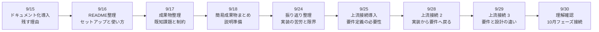
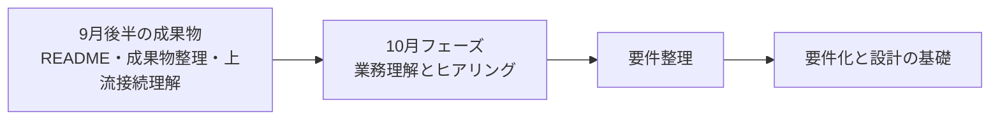

# 3か月新人育成カリキュラム 2026年9月第3-4週 詳細時間割

## 前提

- 開始日: 2026-09-15
- 対象期間: 9月後半の営業日分
- 対象日: 9/15(火), 9/16(水), 9/17(木), 9/18(金), 9/24(木), 9/25(金), 9/28(月), 9/29(火), 9/30(水)
- 補足: 2026年9月は 9/21(月) 敬老の日、9/22(火) 休日、9/23(水) 秋分の日のため、後半は月内9営業日
- ねらい: 実装実践の成果を README や成果物へ整理し、次の上流工程へ入るために「なぜ要件定義や設計が必要か」を実感ベースで理解する

## 9営業日の到達イメージ

## 期間サマリー

| 日付 | その日の主題 | その日が終わった時の状態 |
| --- | --- | --- |
| 9/15 | ドキュメント化の意味を理解する | なぜ残す必要があるかを説明できる |
| 9/16 | READMEを整理する | セットアップと使い方を第三者向けに書ける |
| 9/17 | 既知課題と制約を整理する | 未実装事項や注意点を言語化できる |
| 9/18 | 成果物を説明できる形へまとめる | 実装内容と工夫点を説明できる |
| 9/24 | 実装経験を振り返る | 苦労点と不足していた前提を整理できる |
| 9/25 | 上流接続の導入に入る | なぜ要件定義が必要かを実感ベースで説明できる |
| 9/28 | 実装から要件へ戻る視点を持つ | 仕様の曖昧さが実装へどう影響するか説明できる |
| 9/29 | 要件と設計の違いを理解する | 何を決める工程かを区別して説明できる |
| 9/30 | 次フェーズ前の理解確認を行う | 10月の上流基礎へ向けた不足理解を整理できる |

## 9/15(火)

| 時間 | セッション | 実施内容 | 期待アウトプット |
| --- | --- | --- | --- |
| 09:00-10:00 | 週初共有 | ここまでの実装実践を振り返り、今週は「残す・説明する」に重点を置くことを共有する | 週初メモ |
| 10:00-12:00 | ドキュメント化導入 1 | なぜ README や手順書が必要か、第三者が再現できる状態の意味を説明する | ドキュメント化導入メモ |
| 12:00-13:00 | 成果物棚卸し | これまで作った画面、API、DB構成、確認手順を棚卸しする | 成果物棚卸しメモ |
| 13:00-14:00 | README観点整理 | セットアップ、起動方法、使い方、前提条件、既知課題の項目を整理する | README観点メモ |
| 14:00-14:15 | 休憩 | 短休憩 | なし |
| 14:15-15:00 | AI活用練習 | README の章立て案をAIに出させ、必要な章だけを採用する練習をする | AI活用メモ |
| 15:00-16:30 | 講師確認 | 何を残すべきか、誰向けに書くか、粒度の妥当性を確認する | 確認結果 |
| 16:30-18:00 | ふり返り | 書けそうな項目、まだ言語化しづらい項目を整理する | 日報、未解決点リスト |

## 9/16(水)

| 時間 | セッション | 実施内容 | 期待アウトプット |
| --- | --- | --- | --- |
| 09:00-09:30 | 朝会 | 前日の詰まり共有、README作成の優先順位確認 | 当日タスク整理 |
| 09:30-10:30 | README整理 1 | セットアップ、起動、停止、前提環境を文章化する | README初版前半 |
| 10:30-12:00 | README整理 2 | 画面概要、主な機能、操作手順を第三者向けに整理する | README初版後半 |
| 12:00-13:00 | 再現確認 | README の手順だけで再現できるかを自分で読み返して確認する | 再現確認メモ |
| 13:00-14:00 | ハンズオン修正 | 曖昧な表現、抜けている前提、誤読しやすい箇所を修正する | README改善版 |
| 14:00-14:15 | 休憩 | 短休憩 | なし |
| 14:15-15:00 | AIレビュー練習 | README の説明不足箇所をAIに出させ、自分で採否判断する | AIレビュー記録 |
| 15:00-16:30 | 講師レビュー | 第三者が読んで再現できるか、情報不足がないかを確認する | 指摘一覧 |
| 16:30-18:00 | 小まとめ | 書きやすかった項目、説明しづらかった項目を整理する | 説明メモ、日報 |

## 9/17(木)

| 時間 | セッション | 実施内容 | 期待アウトプット |
| --- | --- | --- | --- |
| 09:00-09:30 | 朝会 | 既知課題整理の目的確認 | 当日タスク整理 |
| 09:30-10:30 | 成果物整理 1 | 未実装事項、仮実装、操作上の注意点を洗い出す | 既知課題メモ |
| 10:30-12:00 | 成果物整理 2 | 制約条件、動作前提、想定外ケースを言語化する | 制約整理メモ |
| 12:00-13:00 | 品質観点整理 | 正常系、異常系、再現性、説明責任の観点で抜け漏れを確認する | 品質観点メモ |
| 13:00-14:00 | ハンズオン修正 | README や成果物メモへ既知課題、制約、注意点を反映する | 成果物整理版 |
| 14:00-14:15 | 休憩 | 短休憩 | なし |
| 14:15-15:00 | デバッグ接続 | 「わかっている不具合」と「まだ原因不明」を区別して残す練習をする | デバッグ接続メモ |
| 15:00-16:30 | 講師確認 | 既知課題の書き方、誤魔化さず残せているかを確認する | 確認結果 |
| 16:30-18:00 | ふり返り | どこまで書くと十分か、判断が難しかった点を整理する | 日報、未解決点リスト |

## 9/18(金)

| 時間 | セッション | 実施内容 | 期待アウトプット |
| --- | --- | --- | --- |
| 09:00-09:30 | 朝会 | 成果物説明準備の目的確認 | 当日タスク整理 |
| 09:30-10:30 | 成果物まとめ 1 | 作ったもの、できること、できていないことを短く整理する | 成果物要約メモ |
| 10:30-12:00 | 成果物まとめ 2 | 実装の工夫点、苦労した点、今後の改善余地を整理する | 工夫点整理メモ |
| 12:00-13:00 | 説明構成整理 | 結論→概要→工夫点→課題→次アクションの順で話す構成を作る | 説明構成メモ |
| 13:00-14:00 | 口頭説明練習 | README や成果物を見せながら、第三者向けに説明する練習を行う | 口頭説明初版 |
| 14:00-14:15 | 休憩 | 短休憩 | なし |
| 14:15-15:00 | AI活用練習 | 説明のわかりにくい箇所をAIに指摘させ、自分で修正する | AI活用メモ |
| 15:00-16:30 | 週次レビュー | 成果物の見せ方、説明の筋、課題共有の仕方を講師が確認する | 指摘一覧 |
| 16:30-18:00 | 週末ふり返り | 書けることと話せることの差、説明時の詰まりを整理する | 週報、補強ポイント |

## 9/24(木)

| 時間 | セッション | 実施内容 | 期待アウトプット |
| --- | --- | --- | --- |
| 09:00-09:30 | 朝会 | 祝日明けの再始動、上流接続へ入る前の振り返り目的共有 | 当日タスク整理 |
| 09:30-10:30 | 振り返り整理 1 | 実装で苦労したこと、曖昧な仕様に困ったことを洗い出す | 苦労点メモ |
| 10:30-12:00 | 振り返り整理 2 | 「最初に何が決まっていれば楽だったか」を言語化する | 事前に欲しかった情報メモ |
| 12:00-13:00 | 課題分類 | 仕様不足、設計不足、確認不足、実装力不足を分けて整理する | 課題分類メモ |
| 13:00-14:00 | ハンズオン整理 | 困りごとを工程にひもづけ、どこで防げたかを考える | 工程ひもづけメモ |
| 14:00-14:15 | 休憩 | 短休憩 | なし |
| 14:15-15:00 | AI活用練習 | 苦労点から必要な事前整理観点をAIに出させ、自分で整理し直す | AI活用メモ |
| 15:00-16:30 | 講師確認 | 実装苦労と上流不足のつながりを説明できるか確認する | 確認結果 |
| 16:30-18:00 | ふり返り | 実装経験から見えてきた「先に決めるべきこと」を整理する | 日報、未解決点リスト |

## 9/25(金)

| 時間 | セッション | 実施内容 | 期待アウトプット |
| --- | --- | --- | --- |
| 09:00-09:30 | 朝会 | 上流接続導入の目的確認 | 当日タスク整理 |
| 09:30-10:30 | 上流接続導入 1 | 要件定義とは何か、なぜ必要かを実装経験に結びつけて説明する | 上流接続導入メモ |
| 10:30-12:00 | 上流接続導入 2 | 実装前に決めておきたい対象範囲、利用者、入力項目、例外ケースを整理する | 事前整理観点メモ |
| 12:00-13:00 | 比較整理 | 「決まっていた情報」と「決まっていなかった情報」が実装へ与えた影響を比較する | 比較整理メモ |
| 13:00-14:00 | 小演習 | 小さな画面仕様を見て、実装前に確認したいことを洗い出す | 小演習結果 |
| 14:00-14:15 | 休憩 | 短休憩 | なし |
| 14:15-15:00 | AIレビュー練習 | 仕様の曖昧さ候補をAIに出させ、自分で優先順位をつける | AIレビュー記録 |
| 15:00-16:30 | 講師レビュー | 実装前確認の観点、質問の粒度、抜け漏れを確認する | 指摘一覧 |
| 16:30-18:00 | 小まとめ | 何を先に決めるべきか、自分の言葉で整理する | 説明メモ、日報 |

## 9/28(月)

| 時間 | セッション | 実施内容 | 期待アウトプット |
| --- | --- | --- | --- |
| 09:00-10:00 | 週初共有 | 上流接続の続きとして、実装から要件へ戻る視点を共有する | 週初メモ |
| 10:00-12:00 | 上流接続 2-1 | 実装時に困った仕様不足を、利用者、画面、入力、出力、例外へ分解する | 仕様不足分解メモ |
| 12:00-13:00 | 上流接続 2-2 | 利用者視点と実装者視点で、必要な情報がどう違うかを整理する | 視点整理メモ |
| 13:00-14:00 | ハンズオン演習 | 既存の小規模機能に対し、事前に欲しかった確認項目表を作る | 確認項目表初版 |
| 14:00-14:15 | 休憩 | 短休憩 | なし |
| 14:15-15:00 | AI活用練習 | 確認項目の漏れ候補をAIに出させ、自分で採否判断する | AI活用メモ |
| 15:00-16:30 | 講師確認 | 利用者視点、実装視点、例外視点の観点が揃っているか確認する | 確認結果 |
| 16:30-18:00 | ふり返り | 実装経験があると見える観点を整理する | 日報、未解決点リスト |

## 9/29(火)

| 時間 | セッション | 実施内容 | 期待アウトプット |
| --- | --- | --- | --- |
| 09:00-09:30 | 朝会 | 要件と設計の違いを整理する目的確認 | 当日タスク整理 |
| 09:30-10:30 | 上流接続 3-1 | 要件定義と設計の違い、何を決める工程かを説明する | 要件と設計の違いメモ |
| 10:30-12:00 | 上流接続 3-2 | 画面、入力、出力、権限、例外などを「要件」と「設計」に分けて整理する | 分類演習結果 |
| 12:00-13:00 | 比較演習 | 同じ機能でも、要件レベルと設計レベルで書き方がどう変わるかを整理する | 比較演習メモ |
| 13:00-14:00 | ハンズオン演習 | 簡単な問い合わせ機能を題材に、要件メモと設計メモを分けて書く | 要件/設計メモ初版 |
| 14:00-14:15 | 休憩 | 短休憩 | なし |
| 14:15-15:00 | AIレビュー練習 | 要件と設計が混ざっている箇所をAIに指摘させ、自分で整理し直す | AIレビュー記録 |
| 15:00-16:30 | 講師レビュー | 分け方の妥当性、粒度、抜け漏れを確認する | 指摘一覧 |
| 16:30-18:00 | 小まとめ | 工程ごとに何を考えるべきかを整理する | 説明メモ、日報 |

## 9/30(水)

| 時間 | セッション | 実施内容 | 期待アウトプット |
| --- | --- | --- | --- |
| 09:00-09:30 | 朝会 | 月末の理解確認観点共有 | 当日タスク整理 |
| 09:30-10:30 | 総復習 | ドキュメント化、成果物整理、上流接続の学びを振り返る | 総復習メモ |
| 10:30-12:00 | 理解確認 1 | README、既知課題、要件化観点、要件/設計の違いを記述と口頭で確認する | 理解確認結果 |
| 12:00-13:00 | 理解確認 2 | 簡単な機能に対して、実装前に確認すべきことを整理する実技確認を行う | 実技確認結果 |
| 13:00-14:00 | 口頭説明 | 実装経験を踏まえて、なぜ上流工程が必要かを口頭で説明する | 口頭説明メモ |
| 14:00-14:15 | 休憩 | 短休憩 | なし |
| 14:15-15:00 | 再学習ポイント整理 | 10月の業務理解・ヒアリングへ向けて不足理解を整理する | 個人補強メモ |
| 15:00-16:30 | 補強演習 | README、要件観点、要件/設計の分け方で苦手な箇所を再整理する | 補強結果 |
| 16:30-18:00 | 締め | 10月の上流基礎フェーズへ入る前提条件を共有する | 総括メモ、日報 |

## 講師チェックポイント

| 観点 | 9/15-9/30で見たい状態 |
| --- | --- |
| ドキュメント化 | README や手順を第三者向けに整理できる |
| 成果物整理 | 既知課題、制約、未実装事項を誤魔化さず残せる |
| 説明力 | 作ったもの、課題、次の改善点を結論先出しで説明できる |
| 上流接続理解 | 実装前に確認すべきことを観点として出せる |
| 要件と設計の違い | 何を決める工程かを区別して説明できる |
| AI活用 | 文書整理や観点出しでAIを使っても採用理由を言える |
| 報連相 | 不足情報や曖昧さを早めに共有できる |

## 次月への接続

