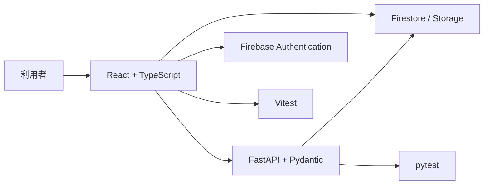

# 3か月新人育成カリキュラム 技術要件

## 位置づけ

この資料は、3か月新人育成カリキュラムで採用する技術要件を整理したものです。  
前提として、社外案件で接続しやすく、未経験者でも基礎を学びやすい構成を優先しています。

## 技術選定の基本方針

| 観点 | 方針 |
| --- | --- |
| 実務接続 | 社外案件で比較的触れる機会が多い技術を優先する |
| 学習しやすさ | 概念が整理しやすく、情報量が多い技術を選ぶ |
| AI活用相性 | AIに質問しやすく、コード補助を受けやすい技術を選ぶ |
| 3か月の現実性 | 未経験者が最低限の成果物を作れる範囲に絞る |
| 運用しやすさ | 研修環境の構築や再利用がしやすい構成にする |

## 推奨技術スタック

| 領域 | 採用技術 | 役割 | 採用理由 |
| --- | --- | --- | --- |
| フロントエンド言語 | TypeScript | 画面実装の主言語 | 型の入口に触れつつ、React と相性がよい |
| フロントエンドFW | React | UI構築 | 実務接続しやすく、コンポーネント思考を学びやすい |
| フロント開発基盤 | Vite | 開発環境 | 初学者でも起動が軽く、構成が比較的シンプル |
| UIスタイル | CSS / Tailwind CSS | 画面装飾 | CSS基礎を学ばせつつ、実装速度も担保しやすい |
| フォーム | React Hook Form | 入力フォーム制御 | React のフォーム実装を整理しやすい |
| API通信 | fetch または Axios | API連携 | HTTP通信の基本を理解しやすい |
| バックエンド言語 | Python | API実装言語 | 文法が比較的読みやすく、FastAPI と相性がよい |
| バックエンドFW | FastAPI | API構築 | バリデーションやAPI設計を学びやすい |
| バリデーション | Pydantic | 入出力検証 | FastAPI と一体で理解しやすい |
| DB/インフラ | Firebase | 認証、ホスティング、BaaS周辺 | 研修で環境差異を減らしやすい |
| 認証 | Firebase Authentication | ログイン機能 | 認証の基本概念を短期間で扱いやすい |
| データ保存 | Firestore | データ保存 | 小規模アプリの開発速度を上げやすい |
| ファイル管理 | Firebase Storage | 画像・資料保存 | 実務で出やすいアップロード体験を作りやすい |
| テスト | Vitest / pytest | 単体テスト | フロントとバックの両方で基礎テストを入れやすい |
| API確認 | Swagger UI / Postman | API確認 | リクエストとレスポンスの理解に役立つ |
| ソース管理 | Git / GitHub | 変更管理、レビュー | チーム開発の基本を押さえられる |

## 全体構成イメージ

## フロントエンド要件

| 項目 | 採用方針 | 学ばせる範囲 | 今回は深追いしないもの |
| --- | --- | --- | --- |
| 言語 | TypeScript を採用 | 変数、関数、オブジェクト、型注釈、props の基本 | 高度な型体操、generics の深掘り |
| UI構築 | React を採用 | コンポーネント、props、state、イベント、フォーム | 複雑な最適化、状態管理ライブラリの多用 |
| ビルド環境 | Vite を採用 | 起動、開発サーバ、環境変数の基本 | ビルド最適化の詳細 |
| スタイリング | CSS 基礎 + Tailwind CSS 推奨 | レイアウト、余白、色、レスポンシブの基本 | 高度なデザインシステム設計 |
| API連携 | `fetch` を基本、必要なら Axios | GET/POST、JSON、エラー処理、ローディング表示 | 通信抽象化の複雑な設計 |
| 入力制御 | React Hook Form 推奨 | 入力値管理、バリデーション、送信処理 | 複雑なフォーム最適化 |
| 画面品質 | ESLint / Prettier を推奨 | 整形、警告確認、最低限の品質維持 | 厳密なルールカスタマイズ |

## バックエンド要件

| 項目 | 採用方針 | 学ばせる範囲 | 今回は深追いしないもの |
| --- | --- | --- | --- |
| 言語 | Python を採用 | 関数、辞書、リスト、例外処理、モジュール分割 | 高度なメタプログラミング |
| API構築 | FastAPI を採用 | ルーティング、リクエスト/レスポンス、HTTPメソッド、ステータスコード | 複雑なDI設計 |
| バリデーション | Pydantic を採用 | 入力検証、型変換、レスポンスモデル | 複雑なネストモデルの設計 |
| 認証連携 | Firebase Authentication と連携 | トークン確認、ログイン状態の扱い | 複数認証方式の実装 |
| データ処理 | Firestore を基本利用 | CRUD、ID管理、更新、取得、削除 | 大規模性能チューニング |
| 例外処理 | FastAPI 標準を基本利用 | エラー返却、バリデーションエラー、ログの基本 | 監視基盤との高度連携 |
| テスト | pytest を採用 | API単体テスト、正常系/異常系、モックの基本 | 高度な統合テスト設計 |

## Firebase 要件

| 項目 | 採用方針 | 学ばせる範囲 | 注意点 |
| --- | --- | --- | --- |
| Authentication | 採用 | ログイン、ログアウト、ユーザー識別 | 認証は使えるだけでなく仕組みの概要も理解させる |
| Firestore | 採用 | コレクション、ドキュメント、CRUD、権限の基本 | SQLの基礎学習は別途必要 |
| Storage | 必要に応じて採用 | ファイルアップロード、URL取得 | 画像や添付が不要なら後回し可 |
| Hosting | 必要に応じて採用 | デプロイの入口 | 本番運用の深掘りまでは不要 |
| Security Rules | 最低限採用 | 認可の考え方、公開範囲の制御 | ルールをコピペで済ませないようにする |

## 学習させる外部ライブラリの推奨範囲

| 区分 | 推奨 | 理由 |
| --- | --- | --- |
| 必須寄り | React, TypeScript, FastAPI, Pydantic, Firebase SDK, Git | この研修の中核になるため |
| あると良い | Tailwind CSS, React Hook Form, Vitest, pytest, Axios | 実装速度と理解整理を両立しやすいため |
| 後回し推奨 | Redux, Next.js, Docker, Terraform, GraphQL, Celery | 3か月未経験には論点が増えやすいため |

## 言語・FW・ライブラリの学習優先度

| 優先度 | 対象 | 到達イメージ |
| --- | --- | --- |
| 最優先 | HTML, CSS, TypeScript基礎, React基礎, Python基礎, FastAPI基礎, Git基礎 | 小さな画面とAPIを自力でつなげられる |
| 高 | Firestore, Firebase Auth, テスト基礎, APIデバッグ, フォーム実装 | 認証付きの簡易業務アプリを作れる |
| 中 | Tailwind CSS, React Hook Form, Storage, Hosting | 研修成果物の完成度を上げられる |
| 低 | 高度な状態管理、高度なインフラ、自動化基盤 | 研修後または案件配属後に拡張する |

## 未経験者に対する技術の切り分け

| 分類 | 必ず理解させること | 使えればよいこと |
| --- | --- | --- |
| フロント | コンポーネント、state、イベント、フォーム、API通信 | 細かな最適化、複雑なカスタムフック |
| バック | HTTP、ルーティング、入力検証、CRUD、エラー処理 | 高度な設計パターン、非同期処理の深掘り |
| Firebase | 認証、保存、取得、権限の基本 | 高度な運用設計、課金最適化 |
| テスト | 正常系/異常系の考え方、1本以上のテストを書く | 網羅的な自動テスト設計 |
| Git | 変更保存、履歴確認、ブランチの基本 | 複雑なrebase運用 |

## 研修用の標準課題イメージ

| フェーズ | 課題例 | 学べる技術 |
| --- | --- | --- |
| 序盤 | ToDoアプリ | React、TypeScript、フォーム、CRUDの基本 |
| 中盤 | 問い合わせ管理ミニアプリ | React、FastAPI、Firestore、認証、API連携 |
| 終盤 | 模擬業務システム | 要件整理、設計、実装、テスト、提案まで通しで体験 |

## 技術選定の結論

| 領域 | 結論 |
| --- | --- |
| フロントエンド | React + TypeScript + Vite を標準にする |
| バックエンド | Python + FastAPI + Pydantic を標準にする |
| インフラ/BaaS | Firebase Authentication + Firestore を標準にする |
| 補助ライブラリ | Tailwind CSS、React Hook Form、Vitest、pytest を優先採用候補にする |
| 後回し技術 | Redux、Next.js、Docker などは初回3か月では原則後回しにする |

