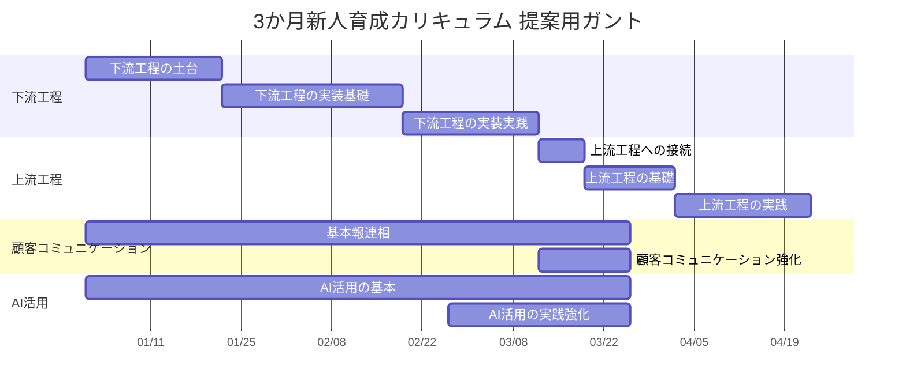
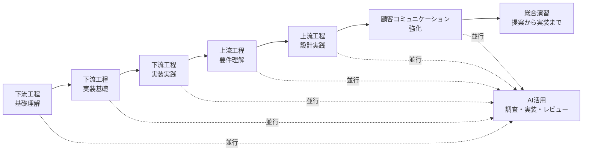
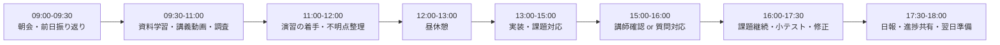

# 3か月新人育成カリキュラム 提案用ガントと週間スケジュール

## 位置づけ

この資料は、提案の場でカリキュラム全体の進み方を説明するための資料です。  
大項目ごとの進行イメージと、1週間5営業日の標準的な学習運用をまとめています。

## 大項目ごとの進行イメージ

| ガントの目盛り目安 | 意味 |
| --- | --- |
| 2週間 | 開始から2週間 |
| 1ヵ月 | 開始から4週間 |
| 1ヵ月半 | 開始から6週間 |
| 2ヶ月 | 開始から8週間 |
| 2ヶ月半 | 開始から10週間 |
| 3ヶ月 | 開始から12週間 |

## 大項目の見え方

| 大項目 | 進み方のイメージ | 補足 |
| --- | --- | --- |
| 下流工程 | 前半の中心として最も厚く進める | 未経験者がまず手を動かし、実装の感覚を掴むため |
| 上流工程 | 下流経験の後に接続して進める | 実装経験がある方が要件や設計の意味を理解しやすいため |
| 顧客コミュニケーション | 基本は通年で軽く、終盤で強化する | アサイン直前に対外対応力を高めるため |
| AI活用 | 全体を通して使い、終盤で実践を強める | 独立科目ではなく、学習効率を上げる補助線として扱うため |

## 顧客コミュニケーションで行う具体内容

| 場面 | 具体的に行うコミュニケーション | 研修で確認したいこと |
| --- | --- | --- |
| 日次報告 | 進捗、詰まり、次にやることを結論先出しで共有する | 報連相の基本ができるか |
| 質問・相談 | 不明点、判断に迷う点、リスクを早めに相談する | 抱え込まずに相談できるか |
| 会議参加 | 相手の話を整理し、確認質問を行い、認識齟齬を減らす | 受け身で終わらず理解を深められるか |
| 議事録共有 | 決定事項、論点、宿題、次アクションを記録して共有する | 会話を再利用できる形に残せるか |
| 仕様確認 | 画面やAPIの仕様について、曖昧な点を具体化して確認する | 技術内容を相手に合わせて聞けるか |
| 課題共有 | 遅延、品質懸念、技術的リスクを早めに共有し、代替案も添える | 問題を早期に見える化できるか |
| 説明 | 実装内容、設計意図、進捗状況を非エンジニアにも伝わる言葉で説明する | 専門用語をかみ砕いて話せるか |
| 提案 | 改善案、次フェーズ案、追加施策案を顧客課題に紐づけて提案する | 守りだけでなく攻めの会話ができるか |

## 顧客コミュニケーションの進め方イメージ

| フェーズ | 主に行う内容 |
| --- | --- |
| 序盤 | 日次報告、質問、相談、簡単な進捗共有 |
| 中盤 | 仕様確認、議事録、課題共有、説明の練習 |
| 終盤 | 模擬顧客対応、提案型コミュニケーション、追加提案 |

## 大項目ごとのもう少し細かい進行

## 1週間の標準スケジュール方針

| 観点 | 方針 |
| --- | --- |
| 稼働時間 | 9:00-18:00 |
| 休憩 | 12:00-13:00 |
| 学習構成 | 午前はインプット中心、午後は演習・実装中心 |
| 講師介入 | 毎日固定ではなく、節目と詰まり時に入る |
| 理解確認 | 週中と週末に軽い確認を入れる |

## 1日の基本進行

## 5営業日の標準時間割

| 時間 | 月 | 火 | 水 | 木 | 金 |
| --- | --- | --- | --- | --- | --- |
| 09:00-09:30 | 週初共有・目標設定 | 朝会・進捗確認 | 朝会・進捗確認 | 朝会・進捗確認 | 朝会・週末確認 |
| 09:30-11:00 | 新テーマの学習 | 前日の続き学習 | 新テーマの補足学習 | 実践テーマ学習 | 週の総復習 |
| 11:00-12:00 | 基礎演習 | 演習 | 小テスト準備 | 演習 | 小テストまたは口頭確認 |
| 12:00-13:00 | 休憩 | 休憩 | 休憩 | 休憩 | 休憩 |
| 13:00-15:00 | 実装課題 | 実装課題 | 小テスト / 実装課題 | 実装課題 | 週次課題まとめ |
| 15:00-16:00 | 講師QA / レビュー | 講師QA / レビュー | 講師QA / フィードバック | 講師QA / レビュー | 講師評価 / 面談 |
| 16:00-17:30 | 課題継続 | 課題継続 | フィードバック反映 | 課題継続 | 再提出 / 弱点補強 |
| 17:30-18:00 | 日報 | 日報 | 日報 | 日報 | 週報・翌週準備 |

## 1週間の役割分担イメージ

| 曜日 | 主な目的 |
| --- | --- |
| 月 | 新しいテーマに入る、ゴールを明確にする |
| 火 | 学習内容を演習へ落とす |
| 水 | 小テストや中間確認で理解度を測る |
| 木 | フィードバックを反映して完成度を上げる |
| 金 | 週次評価、弱点補強、翌週への接続を行う |

## 講師が入りやすい時間帯

| 時間帯 | 介入内容 |
| --- | --- |
| 09:00-09:30 | 目標設定、詰まり共有、優先順位整理 |
| 15:00-16:00 | レビュー、質問対応、理解確認 |
| 金曜 15:00-17:30 | 週次評価、小テスト返却、再学習指示 |

## 運用上の補足

| 観点 | 方針 |
| --- | --- |
| 資料学習中心の運用 | まず資料で進め、止まった時だけ講師が入る |
| 学習速度の差 | 水曜と金曜を調整ポイントにして遅れを吸収する |
| 小テストの使い方 | 合否より、次にどこを補強するかを決める材料にする |
| 提案時の伝え方 | 「常時講師付き」ではなく「自走中心 + 要所介入」と伝える |
