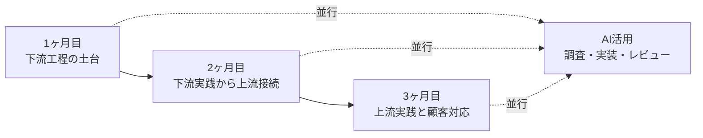

# 3か月新人育成カリキュラム 月別時間割案

## 前提

- 期間区分: 1ヶ月目、2ヶ月目、3ヶ月目
- 目的: 週単位より上位の粒度で、各月に何を重点配置するかを時間割として見える化する
- 想定: 1日 9:00-18:00、昼休憩 12:00-13:00、短休憩 14:00-14:15

## 3ヶ月の流れ

## 1ヶ月目

| 観点 | 内容 |
| --- | --- |
| 月テーマ | 開発環境、プログラミング基礎、フロントエンド基礎、API連携基礎を固める |
| 到達目標 | 小規模なフロント機能を自力で実装し、API接続の基本を説明できる |
| 主成果物 | 問い合わせ受付ミニアプリ、README、週次レビュー記録 |

| 時間 | 月-火の比重 | 水-金の比重 |
| --- | --- | --- |
| 09:00-10:00 | 週目標設定、前回復習、講義導入 | 進捗確認、理解確認、弱点補強 |
| 10:00-12:00 | 文法、HTML/CSS、JavaScript、React、HTTP基礎 | 演習、ミニテスト、レビュー反映 |
| 12:00-13:00 | 昼休憩 | 昼休憩 |
| 13:00-14:00 | ハンズオン実装 | 実装継続、コード整理 |
| 14:00-14:15 | 休憩 | 休憩 |
| 14:15-15:00 | AI活用練習、調査手順確認 | デバッグ、質問整理 |
| 15:00-16:30 | 実装演習、講師レビュー | 小テスト、総合演習、フィードバック |
| 16:30-18:00 | 日報、ふり返り、翌日準備 | 週報、提出物整理、再学習指示 |

## 2ヶ月目

| 観点 | 内容 |
| --- | --- |
| 月テーマ | バックエンド基礎、DB基礎、認証、テスト、デバッグを通して下流工程を実践レベルへ引き上げる |
| 到達目標 | APIとDBを含む小規模機能を実装し、正常系と異常系を整理して説明できる |
| 主成果物 | FastAPI課題、CRUD課題、認証付きミニ機能、テストコード |

| 時間 | 月-火の比重 | 水-金の比重 |
| --- | --- | --- |
| 09:00-10:00 | API仕様確認、前週課題レビュー、優先順位整理 | 進捗共有、不具合共有、理解確認 |
| 10:00-12:00 | FastAPI、HTTP、Pydantic、DB、認証の講義と読解 | API実装、DB接続、バグ修正、テスト追加 |
| 12:00-13:00 | 昼休憩 | 昼休憩 |
| 13:00-14:00 | ハンズオンでAPI作成 | CRUD実装、認証連携 |
| 14:00-14:15 | 休憩 | 休憩 |
| 14:15-15:00 | ログ確認、エラー切り分け、AIでの原因仮説整理 | テスト観点整理、レビュー準備 |
| 15:00-16:30 | 実装レビュー、設計確認 | 小テスト、総合課題、講師評価 |
| 16:30-18:00 | 日報、改善点整理 | 週報、再提出、補講判断 |

## 3ヶ月目

| 観点 | 内容 |
| --- | --- |
| 月テーマ | 要件定義、設計、顧客コミュニケーション、提案、総合演習を通して実案件に近づける |
| 到達目標 | 要件整理から簡易設計、実装説明、議事録、提案まで一連の流れを経験する |
| 主成果物 | 要件整理メモ、業務フロー図、要件定義書、画面/API設計、総合演習成果発表 |

| 時間 | 月-火の比重 | 水-金の比重 |
| --- | --- | --- |
| 09:00-10:00 | 顧客課題共有、業務理解、論点整理 | 朝会、模擬会議、進捗確認 |
| 10:00-12:00 | 要件ヒアリング、業務整理、設計講義 | 要件定義書作成、レビュー、資料修正 |
| 12:00-13:00 | 昼休憩 | 昼休憩 |
| 13:00-14:00 | フロー図、画面設計、API設計 | 総合演習、模擬説明、議事録作成 |
| 14:00-14:15 | 休憩 | 休憩 |
| 14:15-15:00 | AIで論点出し、要件抜け漏れ確認 | 提案準備、想定質問整理 |
| 15:00-16:30 | 講師レビュー、顧客説明練習 | 発表、フィードバック、改善反映 |
| 16:30-18:00 | 日報、論点整理 | 週報、最終ふり返り、配属前整理 |

## 月別の講師介入ポイント

| 月 | 重点介入ポイント |
| --- | --- |
| 1ヶ月目 | 環境構築、フロント基礎、AIの使い方、質問習慣の定着 |
| 2ヶ月目 | API責務、DB設計、異常系、テスト、切り分け力 |
| 3ヶ月目 | 要件の粒度、説明力、合意形成、提案の筋の良さ |

## 月別の評価軸

| 月 | 主に見る評価軸 |
| --- | --- |
| 1ヶ月目 | 再現性、基礎理解、画面実装、報連相 |
| 2ヶ月目 | 実装品質、エラー対応、テスト観点、自走力 |
| 3ヶ月目 | 要件整理、設計力、説明力、顧客コミュニケーション |
