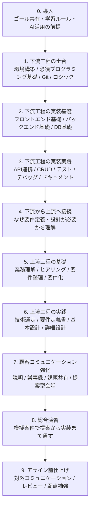
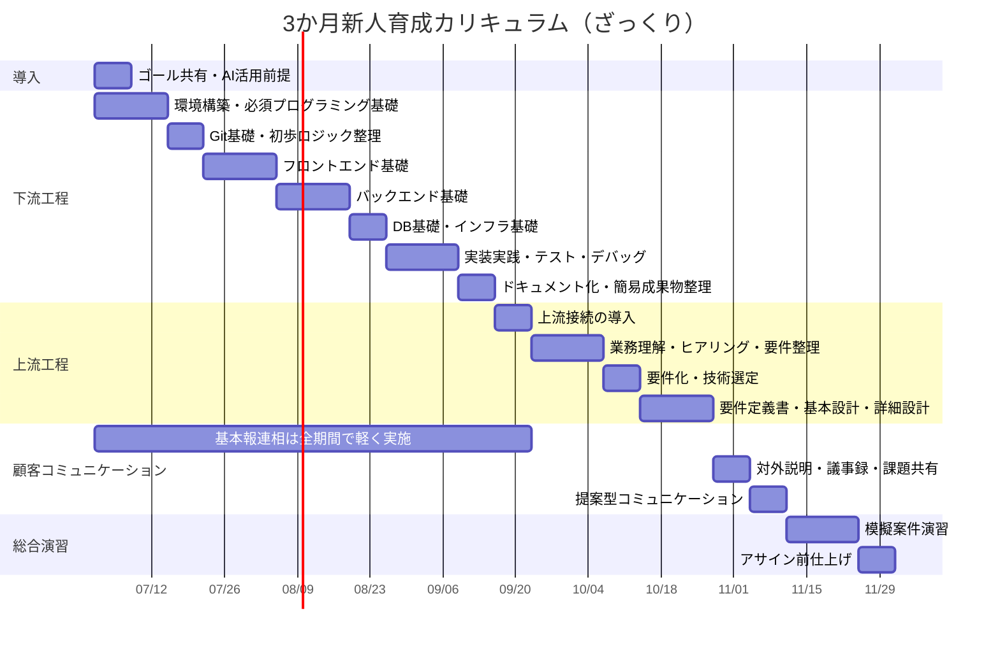

# 3か月新人育成カリキュラム 進行フロー

## 位置づけ

この資料は、3か月カリキュラムを「どの順番で学ぶか」に絞って整理したものです。  
未経験者が実務理解を持って社外案件へ向かう前提で、下流工程から入り、後半で上流工程と顧客コミュニケーションを重ねる流れにしています。

## 進行イメージ

## 時系列での考え方

| フェーズ | ねらい | この順番にする理由 |
| --- | --- | --- |
| 導入 | ゴールと学習姿勢を揃える | 3か月で目指す水準とAIの使い方を最初に合わせるため |
| 下流工程の土台 | 手を動かす前提知識を固める | 実装経験がないと上流の意味が腹落ちしにくいため |
| 下流工程の実装基礎 | 画面・API・DBの基本構造を理解する | システム全体の流れを体感できるため |
| 下流工程の実装実践 | 小さく作って直す経験を積む | 実務で必要な自走力は実装と修正の反復で身につくため |
| 上流への接続 | 上流成果物の必要性を理解する | 先に作る苦労を知ると、要件や設計の価値を理解しやすいため |
| 上流工程の基礎〜実践 | 要件から設計へ落とす力を育てる | 下流経験を踏まえて学ぶ方が具体的に考えやすいため |
| 顧客コミュニケーション強化 | アサイン直前に対外対応力を上げる | 実務像が見えてから学ぶ方が会話の意味が繋がるため |
| 総合演習 | 実務に近い流れを通しで経験する | 断片知識を案件単位の動きへ統合するため |

## ざっくりガントチャート

| ガントの目盛り目安 | 意味 |
| --- | --- |
| 2週間 | 開始から2週間 |
| 1ヵ月 | 開始から4週間 |
| 1ヵ月半 | 開始から6週間 |
| 2ヶ月 | 開始から8週間 |
| 2ヶ月半 | 開始から10週間 |
| 3ヶ月 | 開始から12週間 |

## 補足

| 観点 | 方針 |
| --- | --- |
| 顧客コミュニケーションの厚み | 序盤は報連相だけ、終盤で対外向けを厚くする |
| AI活用の扱い | 独立科目というより、各フェーズで毎回使わせる |
| 上流工程の学び方 | 実装経験を踏まえてから入ることで、抽象論になりにくくする |
| フロントエンドとバックエンドの順序 | 未経験者向けでは並列より、フロントで入出力を体感してからバックへ進む方が理解しやすい |
| 序盤のロジック理解 | この段階では設計書作成ではなく、処理を順番・条件分岐・繰り返しで言葉にできれば十分 |
| 総合演習の役割 | 社外案件前に「作れる」だけでなく「説明できる」状態まで確認する |
