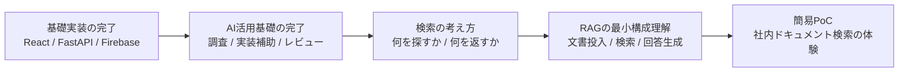

# RAG導入検討メモ

## 位置づけ

この資料は、新人育成カリキュラムに RAG 構築を含めるかどうかを検討するためのメモです。  
現時点では承認待ちのため、正式なカリキュラム本体には含めず、別紙で管理します。

## 現時点の整理

| 観点 | 内容 |
| --- | --- |
| 現在の扱い | 承認待ちの検討テーマ |
| 前提 | AI活用を重視するカリキュラムの発展要素として想定 |
| 本体カリキュラムへの反映 | 未承認のため未反映 |
| 位置づけ | 必須科目ではなく発展科目候補 |

## 新人教育目線での要否

| 観点 | 判断 |
| --- | --- |
| 必須か | 初回3か月では必須ではない |
| 入れる価値 | AI活用の応用例としては価値がある |
| 懸念 | LLM、検索、データ設計、評価の論点が増え、基礎未習得者には重い |
| 教育優先度 | React / FastAPI / Firebase / API / DB / テストの基礎よりは後 |

## 入れるならどこか

| 案 | 位置づけ | 理由 |
| --- | --- | --- |
| 案1 | 総合演習の後半 | 一通りの実装基礎、上流、AI活用基礎を終えてからの方が理解しやすい |
| 案2 | 任意拡張枠 | 3か月の必須範囲を圧迫しにくい |
| 案3 | 配属後の発展学習 | 基礎案件に出られる状態を優先しやすい |

## 入れる場合の推奨順序

## 入れる場合の最小スコープ

| 項目 | 最小限でよい内容 |
| --- | --- |
| 概念理解 | RAG が何を解決するか、通常のチャットとの違い |
| データ準備 | 文書を分割して保持する考え方の理解 |
| 検索 | 類似検索の考え方を知る |
| 回答生成 | 検索結果をもとに回答させる流れを知る |
| 評価 | うまく答えないケースがあることを理解する |

## 今は入れなくてよい内容

| 項目 | 理由 |
| --- | --- |
| ベクトルDBの深掘り | 基礎学習の段階では論点過多になりやすい |
| 高度な検索最適化 | 新人教育の初期段階では優先度が低い |
| 本格運用設計 | まずは概念理解と小規模PoCで十分 |
| 複数モデル比較 | 基礎未習得の段階では判断軸が育ちにくい |

## 現時点の結論

| 項目 | 結論 |
| --- | --- |
| 採用判断 | まだ承認待ち |
| 新人教育での優先度 | 発展扱い |
| 入れるなら | 3か月終盤の総合演習後半か任意拡張枠 |
| 今のおすすめ | 本体カリキュラムには入れず、別紙メモ管理のまま保留 |

